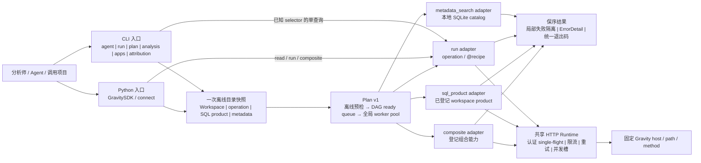
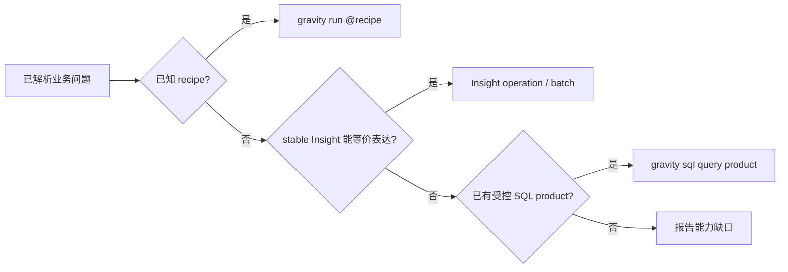

# 架构与概念

## 产品定位

Gravity SDK 是数据分析团队共用的 **Python SDK + Agent 优先 CLI**。两种入口共享同一套
operation 合同、认证、运行时、分页、并发、投影和错误语义：CLI 适合 Agent、终端和流水线，
Python API 适合长期服务和组合逻辑。

它不是通用 HTTP 客户端，也不是业务知识库。调用项目负责“活动、SKU、业务模块、时间窗”
等业务语义；本项目负责把 Gravity 的物理能力变成稳定、可发现、可校验的原子操作。



这张图描述的是同一产品的两个入口，不是两套实现。CLI 负责文件/stdin、机器输出和退出码；
SDK 负责进程内复用。二者最终使用同一 operation 合同、Workspace、Plan 预检、adapter、分页和
错误合同。Plan 也不是任意工作流框架：它只编排四种登记节点，不支持裸 SQL、任意 HTTP、
Python、表达式、join/reduce、条件循环、暂停恢复或分布式队列。

## 运行时边界

| 层 | 负责 | 不负责 |
| --- | --- | --- |
| 调用项目 | 业务实体、指标口径、App/报表绑定、recipe 和 SQL 产品实例 | 猜测上游 URL 或绕过 SDK 策略 |
| CLI / Python facade | 参数解析、可发现 API、稳定 envelope | 复制一套独立执行逻辑 |
| Plan v1 | 离线校验依赖和预算、同层并发、受控绑定/扇出、失败隔离和声明顺序输出 | 自然语言自动执行、任意代码和通用工作流语法 |
| Catalog / Workspace / Resolver | 搜索、描述、绑定、离线校验、父资源诊断、Receipt | 从模糊业务词自动建立事实绑定 |
| Insight 内核 | operation 授权、请求构建、响应投影、分页和结构化错误 | 任意 host、path、method 或未知字段 |
| HTTP Runtime | 登录刷新、共享会话、重试、冷却、进程/host 并发 | operation 或业务语义 |
| Maintainer 工具 | contract 编译、Census、Probe、Evidence 和质量检查 | 普通查询的必经在线链路 |

### 三条真实调用路径

```text
gravity run / GravityInsightClient.read
  → OperationCatalog / Registry
  → PolicyEngine（一次性请求授权）
  → ReadExecutor（codec、投影、envelope）
  → Transport
  → GravityHttpRuntime

gravity plan run / GravitySDK.execute_plan
  → 全 Plan 离线预检（失败时零网络请求）
  → DAG ready queue（同层独立节点并发）
  → run | sql_product | metadata_search | composite adapter
  → 按声明顺序聚合结果

源 operation JSON
  → ContractCompiler
  → manifests/*.json
  → GravityInsightClient.from_env() 加载
```

`operation_id` 是 Insight 的公共接口。固定 host、path、method、输入、响应投影、分页、
稳定性、隐私和最小 probe 都来自合同；上游版本变化优先由合同或 codec 吸收。

Python 推荐入口是惰性的 `GravitySDK/connect`。它缓存 Insight 与 SQL 专用 client，直接提供
`read/read_all/read_many`、组合快照和受控的 `describe_sql_products/query_sql_products`；
Plan 入口只使用登记 adapter，不自动猜查询通道。裸 SQL 只通过显式的 `sdk.sql` /
`GravityClient` 使用，不能进入 Agent Plan。
`GravityInsightClient` 和 `GravityClient` 仍是公开 API，Metadata 与 Census 仍有独立入口。
详细接口见 [SDK 参考](reference/sdk.md)。

## 发现、Workspace 与 Resolver

### 发现优先于读文件

Agent 默认用一次离线 `gravity agent <query>` 完成 bounded search + describe，优先返回匹配的
workspace recipe，并用 stable operation 补足最多 5 张 capability card；每张卡都带必填输入或
参数、下一条 argv 和可直接放进 Plan 的 `plan_node`。多个问题使用一次
`gravity agent --input questions.json`，Workspace、operation inventory、SQL product 和 metadata
catalog 只扫描一次，单项发现失败不会清空其他问题。随后执行一次 `gravity run` 或
`gravity plan run`。需要浏览完整 catalog 时再用
`operations search/describe`。完整搜索也会展示 draft/blocked 条目来暴露覆盖缺口；它们不是
可执行能力。不要读取 manifest 猜字段或把 Census 候选当成合同。

### Workspace 只保存项目意图

`gravity.toml` 可声明 App 别名、默认值、datasource、SQL product 和 recipe。它由调用项目维护，
SDK 只读加载；实例不会进入 wheel。加载顺序和 schema 见
[Workspace 参考](reference/workspace.md)。

### Resolver 减少 Agent 往返

`gravity run` 把 bind、build、validate、parents、exec、diagnose 合并为一次调用。已知 recipe
时直接 `gravity run @name`；不需要先机械执行 `recipe check` 和 `validate`。只有返回 stale
或 diagnostics 要求动作时，再调用对应诊断命令。

Resolver 的完成路径生成 `gravity.receipt.v1`，写到当前 workspace 的
`state_root/receipts/`，并在 envelope 中返回持久化状态。Receipt 只有 operation、输入/输出
形状指纹、合同指纹、状态、耗时和 HTTP 请求数，不含查询值、结果行或凭据。

### 已知一次，未知两次

- 已知 selector 或已经保存 Plan：直接 `gravity run` / `gravity plan run`，一次调用。
- 未知能力：一次 `gravity agent --input` 批量发现，一次 `gravity plan run`，共两次调用。
- 自然语言发现只生成候选和 `plan_node`，永不自动联网执行；调用方必须显式选择和执行。

### 登记组合能力

组合能力解决“同一分析上下文要调用十几条 operation”的重复劳动，同时保留底层原子合同：

| 组合 | CLI | SDK | 当前固定内容 |
| --- | --- | --- | --- |
| Analysis context | `gravity analysis context --app <alias|id>` | `analysis_context()` | event、event property/group、user property、metric、media enum 与 mine/shared/preset template，共 13 个来源 |
| Dashboard snapshot | `gravity analysis dashboard snapshot --app <alias|id> --ref <id-or-exact-name>` | `dashboard_snapshot()` | 精确解析一个看板后读取 detail、dashboard members、space members、condition favourites 与 default favourite，共 5 个控制面来源；不执行图表 |
| Dashboard analysis | `gravity analysis dashboard prepare\|run --app ... --ref ... --start ... --end ...` | `prepare_dashboard_analysis()` / `run_dashboard_analysis()` | 静态 Web artifact 编译边界内的 event/funnel/retention/property/scatter chart；按声明序、单图失败隔离 |
| Saved analysis | `gravity analysis saved prepare\|run --app ... --ref ... --start ... --end ...` | `prepare_saved_analysis()` / `run_saved_analysis()` | 精确解析一个保存分析；reference Web artifact 严格复用五类编译器和显式日期窗，compact definition 保持兼容 |
| Multidim | `gravity multidim query --app <alias\|id> --input <json>` | `multidim_query()` | 闭合物理输入、实时指标校验、有界分页与可选 total；不引入 Spec DSL 或 Web 模板语义 |
| Material performance | `gravity materials performance --app <alias\|id> --start ... --end ...` | `material_performance()` | 仅组合 stable `material.report.query`，按平台保序聚合原生指标；不做跨平台归一或排名 |
| Segment snapshot | `gravity analysis segment snapshot --app <alias|id> --ref <id-or-exact-name> --date <YYYY-MM-DD>` | `segment_snapshot()` | 精确解析一个分群后固定读取 detail、history、daily_result；不返回成员或规则定义 |
| App snapshot | `gravity apps snapshot --app <alias|id>` | `app_snapshot()` | app detail、realtime event、capacity、permission menu、role、template，共 6 个来源 |
| Attribution snapshot | `gravity attribution snapshot --app <alias|id>` | `attribution_snapshot()` | 当前 8 个 stable attribution 配置 operation |
| User journey | `gravity analysis user journey --app ... --client-id ...` | `user_journey()` | 单用户 profile、event timeline、postback 三个受控来源；显式分页 |

组合结果按固定来源顺序返回，每个来源带 scope 和 operation identity；局部失败隔离。Dashboard
snapshot 还会裁掉 detail 中无法证明语义的 opaque config；这些组合不会把 draft operation
伪装成 stable、自动枚举全部 role detail，或把控制面定义当作图表查询执行。

Dashboard analysis 是显式执行产品，不是 Web 页面模拟器。它读取同一稳定目录/详情，把公开静态
Web artifact 已证明的五类图表配置编译为受治理 operation input；不解释 layout，不应用
favourite，也不模拟页面级 global filter。已知 App/ref/window 是一次调用；未知时 Agent 给出
`dashboard_analysis` Plan 节点，调用方补齐再执行，总共两次。自然语言始终停在发现边界。

Saved analysis 的 reference 模式也只消费已登记目录/详情：按稳定 ID 或精确名称解析后，把已证明
的 Web artifact 交给既有 `event/funnel/retention/property/scatter` 编译器，不维护第二套翻译器。
Web artifact 的 `prepare/run` 必须显式给出成对日期窗（`end-start` 不超过 90 天）；compact
reference/definition 仍兼容其原有日期语义。它不复刻 template、layout、favourite、权限或页面状态，Agent 卡也只提供待填写的
`app/ref/start/end`，绝不从自然语言选择引用或执行查询。

Segment snapshot 同样只组合 stable 只读 operation：先按 ID 或精确名称解析一个分群，再并发读取
详情、历史版本与指定日期的单日计算结果。它不读取成员、用户标识或规则定义；名称歧义时失败，
不会选择相似名称或自动执行自然语言请求。

Multidim 不从 Web artifact 编译，也不把物理字段重新命名成另一套 Spec。App 在 input 外显式
绑定；指标、维度、日期和 filters 都由调用方提供，并在闭合 schema 与实时 metadata 边界内
fail closed。完整输入直接一次调用；未知入口是一次 Agent 发现加一次 Plan。N 个独立查询是
一个 Plan 的 N 个同层节点，不新增 batch wrapper。执行请求数为去重 metadata `M` 加 query 页数
`P`，显式请求 total 时再加一次；模板、布局、收藏、拖拽、权限和业务指标含义均不属于该产品。

Material Performance 每个平台提交一个 stable batch item，多个 App 仅形成同一个 `app_list`。
HTTP 数为 `Σ P_platform`。direct worker 默认 6、最大 24，实际平台池最多 4；平台内分页固定
单 worker。共享 item 预算按平台等额 floor 分配且余量不可借用，结果重新计数并对收据 fail closed。

### 候选能力不等于已交付能力

当前基线是 185 个 operation、176 个 stable。本轮 17 个 Analysis、Report、App 和 Attribution
候选均已得到明确探测结论，但新增 stable 数仍为 **0**；它们全部保持 `draft`。逐项证据、
blocker 和下一步最小证据见[候选能力证据矩阵](candidate-capability-matrix.md)。尤其
`attribution.attribution.query` 与 `attribution.attribution_detail.query` 仍不可作为正式 CLI/SDK
查询能力宣传或执行。

## 查询路由



Insight 即使需要几项并发读取，只要语义等价，仍优先于一条重 SQL。SQL 只用于跨表连接、
窗口函数、特殊计算或已审核 Evidence 口径；不能表达时应报告缺口，不生成裸 HTTP 请求。

### SQL 的当前边界

SQL 有两层，不能混为一谈：

- `gravity sql query <product>` 是团队产品入口：读取 workspace product，绑定 App/时间窗，
  限制聚合隐私、投影和行数，并在可用时附加 Evidence reference/warning。
- `sdk.sql.execute_sql()` / `GravityClient.execute_sql()` 是显式低层 SDK 原语：固定 custom-SQL
  host、path、method，复用认证并限制并发；当前只校验 SQL 非空，**不检查 workspace 产品
  登记或 Evidence**。统一 `GravitySDK` 门面只直接提供产品发现与产品查询，不委托裸 SQL。

因此 Agent 默认只能使用第一层的已登记产品。先用 `gravity sql products` 一次发现产品与
batch 输入合同，已知产品时直接执行 `query`。Evidence 新鲜度不是查询授权门禁；缺失或过期
时结果带 warning，而不是迫使 Agent 串行运行 `status → evidence-preflight → verify`。这些是
诊断和授权维护命令。底层 `GravityClient` 适合受控集成代码，不应直接暴露为 Agent 的任意
SQL 工具。

## 并发模型

并发用于彼此独立的工作；有数据依赖时保持串行。

| 场景 | 当前实现 | 调用建议 |
| --- | --- | --- |
| 多个独立 Insight operation | `batch` 默认 6 workers，显式上限 24，保持输入顺序并隔离单项失败 | 一次 `batch read`，不要逐条起进程 |
| 多个 compact Analysis spec | `analysis query batch` 先全量离线编译，再复用 Plan 同层并发 | 一次 batch，不在外层再建线程池 |
| Analysis/App/Attribution 组合 | 外层默认 6、上限 24；各来源独立执行，结果固定顺序 | 使用登记组合，不手写多命令循环 |
| Dashboard snapshot | CLI/SDK 外层默认 5、上限 24；Plan adapter 内部固定 1 worker | 让 Plan 全局 pool 管理跨节点并发，避免“节点 × 5 来源”放大 |
| Dashboard analysis | CLI/SDK run 默认 6、上限 24；Plan adapter 内固定 1；默认 32、硬上限 64 charts | 单图编译/执行隔离并按看板声明顺序聚合 |
| Saved analysis | 单个 reference 只执行一个已编译查询；Plan adapter 内固定分页 worker 1 | 多个互不依赖的保存分析放入同一 Plan，由全局 pool 并发，避免外层线程池 |
| Multidim | CLI/SDK 默认 6、上限 24；metadata 与已知页数共享同一预算；Plan adapter 内固定 1 | 多个独立查询作为同层 Plan 节点，避免“节点 × metadata × 页数”并发放大 |
| Material performance | CLI/SDK 默认 6、上限 24，实际平台池最多 4；每个平台分页 worker 固定 1；Plan adapter 内固定 1 | 平台 fan-out 与分页不相乘；多个独立请求交给 Plan 全局 pool |
| Segment snapshot | CLI/SDK 外层默认 3、上限 24；Plan adapter 内部固定 1 worker | 三源固定保序，Plan 全局 pool 管理跨节点并发 |
| Plan DAG | 一个全局 worker pool，默认 6、上限 24；同层并发、依赖层串行；adapter 内分页 worker 固定 1 | 把交叉查询放进一个 Plan，避免并发乘法放大 |
| Plan foreach | 每节点最多一个，默认最多 32 项、硬上限 64；不支持嵌套和笛卡尔积 | 只用于一个上游数组到一个目标字段的有限扇出 |
| 单个 Insight 的分页 | 首页给出明确 `total_page` 时，`read_all/read_limited` 按小窗口并发并保持页序；未知总页数时串行。最多 1,000 页 / 100,000 items | 使用内建分页，不自行并发猜页 |
| Metadata 全量同步 | 命令支持 `--concurrency 1..24` | 使用内建同步，不写临时循环 |
| SQL 独立请求 / 分页导出 | 进程级并发上限 2；SQL export 最大并发也是 2 | 使用 `execute_batch` 或正式产品/导出函数 |
| 在线 probe | 复用 Insight batch 上限 | 只在维护流程中运行 |

分页窗口 `max_workers` 默认 6、上限 24；batch 内的 `read_all` 固定为 1 个分页 worker，
避免“批任务 × 分页”嵌套放大。HTTP Runtime 还在 worker 之下共享进程级业务槽、每 host
令牌桶、429 冷却与认证 single-flight。因此把 worker 调到 24 不等于会同时发出 24 个请求，
也不应在外层再套线程池绕过它。并发不是越大越快；默认值是日常吞吐入口，上限是安全边界。

Plan 还限制声明节点最多 64、运行时展开最多 256、总 `max_items` 预算最多 100,000。标量
binding 只复制 RFC 6901 JSON Pointer 指向的值，`from` 必须位于 `depends_on`；路径不存在时
返回 `BINDING_FAILED`，不回显绑定值。独立分支失败后其他分支继续，下游标记
`skipped/DEPENDENCY_FAILED`。输出始终按 Plan 声明顺序，foreach 实例按源数组顺序；退出码按
`local 4 > upstream 3 > caller 2 > success 0` 聚合。

## 门禁分层

门禁只应保护真实风险，不应变成每次开发或查询的仪式。

### 运行时硬底线

- 固定 host、path、method 和 effect；默认拒绝写操作与未知 wire 字段；
- 凭据、Cookie、token 和原始用户级输出不进入日志、fixture、stdout 或 Git；
- 响应字段显式投影，敏感字段递归剔除，新字段默认隐藏；
- 分页、结果规模、重试、并发和导出落盘有上限；
- 单元测试不访问生产 Gravity，生产 probe 遵循授权流程。

这些约束不能为了省命令而绕过。

### 发布/兼容检查

合同确定性编译、provenance、fixture、兼容测试、文档链接和完整测试属于提交前检查。
开发内循环只运行与改动相关的编译检查和目标测试；不要求每改一行就跑全套测试、Census、
live probe 或 Evidence 刷新。文档改动、CLI 文案和纯重构也不应被迫制造新合同或 probe。

新增能力如何选择最小扩展面、何时升级门禁，见
[扩展地图](maintainers/extending.md) 和 [新增受控能力](maintainers/operations.md)。

## 数据与隐私边界

- Metadata catalog 保存 App、事件和属性的物理事实，不推断模块、活动、SKU 或指标口径。
- 普通 read 不发布 Evidence、不上传或分享文件，也不修改上游资源。
- 导出是独立 effect，经过导出合同和本地落盘策略。
- 能力数量、平台覆盖和字段列表随合同变化；以 `operations list/search/describe` 的当前输出
  为准，文档不维护易过期的静态数字。
