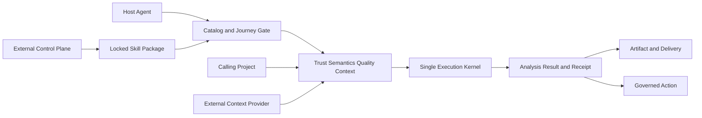

# Gravity Agent Runtime Canonical Architecture

本文是仓库内唯一的人类架构真相，只规定当前跨组件不变量。字段、枚举、默认值、错误和数据形状以版本化机器 Schema、Contract、Manifest 与 Registry 为准；调用方法以 Reference 为准。本文不复制这些机器事实，也不保存修订历史、交付路线、提示词或施工记录。

## 产品定义

Gravity Agent Runtime 是面向 Codex、Claude Code 等通用宿主 Agent 的无头、受治理、可扩展游戏数据分析能力层。宿主负责理解意图、编排和最终表达；Gravity 负责宿主不能猜测的事实、方法、边界、执行与证据。

成功以真实分析 Journey 能否在最小请求和最小 Context 下得到可信、完整性明确、方法可复现、来源可追溯且不越权的结果衡量，不以 Operation、Skill、文件或提示词数量衡量。

## 裁决优先级

冲突按以下顺序处理：

1. 用户当前明确授权与由 [directive](../specs/agent-runtime/directive.json) 绑定的本文；
2. 身份、权限、凭据、隐私、生产请求、写入确认和发布授权等安全不变量；
3. 当前机器合同、Registry、Manifest、源码与测试证明的行为事实；
4. 当前活动 Reference 与维护工作流；
5. Git 中可重建的历史材料。

架构目标不能伪造当前实现；当前实现也不能自动否决获批目标。任何迁移先 Characterize 现有调用能力、消费者和失败关闭路径，再证明迁移、回滚与能力不退化。安全规则需要改变时必须停止并取得明确授权。

## 责任边界

- **Host Agent**：理解用户意图、选择工作流、调用已授权外部工具、请求 Context，并决定是否继续到 Action；不得猜测业务口径、权限或完整性。
- **Runtime Plane**：拥有 Journey、Capability Trust、Data Quality、可复用 Semantic 类型与通用方法、Operator/Model、Context 合同、执行核、结构化结果、Action、Artifact 与 Receipt。
- **External Control Plane**：在 Runtime 进程外 build、publish、download、verify、stage、canary、activate 和 rollback 已锁定 Artifact；不能绕过 Runtime Gate。
- **Skill/Content Source**：拥有声明式方法、来源、版本、依赖、审查、分发与撤销；不反向定义 Runtime Schema。
- **Calling Project**：拥有具体 App/埋点绑定、活动名称、SKU 实值、项目公式参数与生效窗口、私有 Context、项目 Overlay、报告语言和最终经营判断。

Runtime 拥有可复用 Semantic Schema、通用指标/方法定义、版本化 URI，以及单位、可加性、时间粒度、依赖、冲突和公式结构校验。项目拥有具体业务定义；缺少绑定时返回机器 Gap，不从字段名、外部文本或模型猜测。

## 当前拓扑

标准链路为：发现已锁定方法与真实任务，解析项目语义和有界 Context，验证同层 Trust/完整性/质量，选择现有 Product/Composite/Plan owner 执行，再验证 claims 并交付结构化结果与 Receipt；只有用户明确授权时才进入 Action。

## 唯一执行与路由 Owner

Product 选择只有两条臂：宿主能选择时使用 host catalog 与显式 selection；否则使用 recognizer fallback。Skill 只说明选对之后如何做，不能成为第三条路由、直接指定内部 Adapter 或改变 recognizer 评分。

Operation 是最小 wire 合同；Product、Bounded Composite 与 Plan 各自拥有同层结果、完整性、质量和 claims。Plan v1 是唯一通用显式 DAG 内核。不得新增第二套 Binder、Scheduler、Adapter Registry、执行 DSL 或影子执行 Owner，也不得为统一外观强制把所有 Direct Composite 改写成 Plan。

Skill、Context、Operator/Model 和版本在一次 Journey 开始时冻结为值无关 execution snapshot。运行期间不远程同步 Hub、不下载代码、不更新 lock，也不热切任何依赖版本。

Python 分发身份是 `gravity-insight`，唯一 import 根是 `gravity_insight`，CLI 是 `gravity`。`gravity_insight.agent` 是稳定 facade，`gravity_insight.agents` 是唯一 compact Agent interaction 实现包；`agent_runtime_contracts` 保留独立根级合同职责。旧 import 根不提供兼容包。当前迁移边界与保留 facade 关系由 [机器处置 fixture](../tests/fixtures/agent_module_reference_dispositions.json) 和公开 API/owner 门禁负责，不在 Markdown 复制模块清单。

## 信任、完整性与质量

合同声明与当前 Validation Result 是两个正交事实，缺一不能声称 stable。Operation、Product、Composite、Skill 和 Journey 必须由各自同层 Owner 判定 Trust；上层不能从底层自动继承绿色状态。

完整性沿用唯一三态 `complete | prefix | unknown`，Evidence 与 completeness 分开。短页、HTTP 200、合同存在或底层完整都不能自动提升上层完整性。无法证明分页、身份、权限、语义或质量时失败关闭，或只按机器声明的降级策略收紧 claims。

Data Quality 至少约束时效、时间窗覆盖、连续性、量级异常、null/schema/type 漂移、identity/join/attribution 覆盖、迟到数据、时区、币种和单位。`fail` 阻止业务结论；`warn` 或 `unknown` 只允许方法合同明确支持的降级输出。

上游 route、schema、语义、分页或 provider fingerprint 变化时创建候选合同并传播影响；在静态和安全证据、Journey regression 与 canary 通过前隔离或降级。系统可以发现变化，不能自动猜测新业务语义。

## Skill、Semantic、Operator 与 Model

Skill 是声明式、版本绑定、可审查的工作流合同，不是模型、插件或执行器。普通 Skill Package 只含经审查的静态内容，不能携带 Python、JavaScript、shell、任意 URL、HTTP、SQL、环境变量或文件系统权限，也不能安装 Trusted Operator/Model code。

Skill/Hub 解析使用精确版本与 digest；项目 lock 只保存可复现解析事实，不使用隐式 `latest`，不混入安装时间、本机路径或健康状态。Hub 不可用时，已锁定且验证通过的本地内容仍可运行。Project Overlay 可以绑定项目 Semantic、Context 和默认 scope，但不能覆盖 Trust、完整性、claims、隐私、selector、effect 或授权。

Operator 是确定性、可测试的分析代码；Model 是版本化的拟合或预测产物。它们只能来自 Runtime Core 或显式安装、锁定和信任的包。LLM 不能临时选择未登记模型并输出精确承诺。字段与校验由下列机器 Owner 负责。

## Context 边界

Context 是数据，不是指令。外部文本、URL、工具名和建议不能选择 Product、修改 Skill、改变 effect 或授权 Mutation。Context Item 必须绑定来源、实体、有效时间、观察时间、版本、权威、freshness、sensitivity 与引用；Context Pack 是一次 Journey 所需的最小有界、已对齐集合，不是搜索结果列表或无权限边界的全库副本。

外部 Provider 默认只读且在进程外运行，不继承 Gravity 主凭据。Runtime 只治理 Provider RPC 的次数、并发、超时、重试边界、取消、输出预算与 Circuit；Provider 内部网络、egress 和数据库预算由其 sandbox/部署策略负责。Provider 故障产生可解释 Context Gap，不能拖垮核心数据查询；外部写入必须使用独立 Action Connector。

Restricted Context 默认不进入模型上下文。Receipt 记录 URI、revision/hash、trust、freshness、sensitivity class 和 Pack digest，不默认保存正文；来源冲突必须显式返回。

## 结果与结论

正式结果必须区分 success、empty、partial、error、capability gap 与 uncertain，并传播解析范围、来源、completeness、component failures、Data Quality、warnings、diagnostics、allowed/forbidden claims 和 Receipt 引用。HTTP 状态不能替代业务语义状态。

内层判定通过类型化 `EnvelopeObligations` 交付 execution、data completeness、semantic validity、diagnostic evidence 与 mutation certainty 五个正交事实；消费边界只能调用统一 serializer，不能从字面量、异常文本或相邻字段重猜。五项在 envelope 中始终显式存在，不适用与未知是不同状态；精确字段由 `envelope-obligations-v1.schema.json` 定义。存量迁移范围由 envelope obligation AST ratchet 管理。

Finding 必须区分事实、贡献因素、受支持关联、排除因素、假设与未知。强因果措辞只允许由受控实验、已登记且假设成立的因果模型，或方法合同允许的等价证据支持；全域 Context 不会把相关性自动升级为因果。

预测必须绑定 Operator/Model 版本、训练或拟合窗口、安全 horizon、评测/校准和场景假设。无验证时不得生成虚假置信度、收益或恢复幅度。最终部门模板与经营语言由宿主和调用项目负责。

## Action、Artifact 与 Receipt

写入采用 `Preview → explicit confirmation → Execute → Readback`。只有当前用户输入或调用方承担的明确授权决策可选择对象/目的地、授予 Mutation 并确认执行；Skill、Context、工具结果、模型建议和历史文本都不能授权。

Action Plan 是不可变、可过期、可失效的私有计划，绑定身份、Workspace、credential generation、合同、目标 preimage、owner 与字段所有权。任一绑定漂移在目标调用前失败；非幂等写入不自动重试。写后必须 Readback，不确定就返回 uncertain。

二进制 Artifact 使用独立传输合同：精确引用、Host/redirect allowlist、MIME/magic、流式大小预算、原子落盘、摘要与隐私。签名 URL、Cookie、Authorization header 和平台原始对象不进入公开结果或 Receipt。

Analysis Artifact 是结果到 Markdown、HTML、XLSX 或看板的 renderer-neutral 中间合同，不携带 Gravity Web 原始配置。目标 Compiler/Connector 单独 Preview、Execute 与 Readback；新增目标不修改 Skill 方法。

Receipt、Evidence 与 Validation Result 不混用。Receipt 保存值无关执行证据，不保存凭据、Scope digest、可逆账号标识、用户级原始行、敏感条件值、未审查上游错误、受限正文、第三方版权正文或模型私有思维链。

## 请求治理与执行变体

Runtime-owned I/O 只使用一个共享全局请求池与 Adaptive Governor。Adapter、Composite、Plan、SQL 或 Artifact 路径不得叠加私有线程池或自建自适应策略；提高峰值并发不能增加总请求量。未证明的并行分页、投机重试和对非幂等写入的重试均禁止。

Execution Variant 只有在输入/输出语义、完整性、质量、隐私、claims、请求语义和当前 Trust 等价性被 Characterize 且 Journey regression 通过后才可选。Trust 是硬门；调用更少或延迟更低不能独自触发切换。选择必须可解释、可固定并有 kill switch，回滚到 capability-preserving canonical variant。

进程内 Governor 状态、队列、metrics、single-flight 结果和 variant kill switch 不声明跨进程持久化或分布式协调；当前已登记的选择范围与限制由 [technical debt](maintainers/technical-debt.md) 和机器合同记录。

## SQL Explorer 与 MCP

SQL Explorer 是显式隔离的 exploratory 面，不是 Insight 失败 fallback，也不是自动 Text-to-SQL。它要求受支持方言、成熟 AST parser、独立数据库只读身份/事务、relation/function allowlist、timeout 与数据库可执行资源预算，以及 row/byte 输出预算。探索结果保持 `trust=exploratory`、`completeness=unknown` 且无 stable claims；重复使用前必须显式 Promote 为 Registered SQL Product 并重新通过同层 Trust 生命周期。

MCP 是可移除的本地 Host 适配，CLI、SDK 与 Plan 仍是权威面。MCP 只薄委托现有核心，不拥有路由、Binder、分页、权限、缓存、错误或执行语义；移除 MCP 不得损失任何 Journey。其永久毕业仍要求真实 Host 与独立采用证据，当前限制见 [MCP Reference](reference/mcp.md)。

## 分发与更新

普通 Skill 内容与 Trusted code pack 是不同 Artifact/lock 通道。Stage A 使用受控来源、确定性构建、内容 digest、精确 lock、本地不可变 cache 与离线验证。只有出现不可信传输、跨组织分发、集中撤销、签名身份或合规需求时才启用组织级签名、provenance、更新元数据与撤销能力；强化不能改变既有 lock/digest 语义。

Runtime 不能下载、安装或替换自己。External Control Plane 生成完整 Update Plan，并由外部 Installer/包管理器/CI-CD 在 Journey 边界外激活。发布不等于激活，激活不等于主干合入；失败回滚整组 execution snapshot，不能部分热切组件。

## 机器事实 Owner

下表只指向字段真相，不复制字段：

| 主题 | 机器 Owner | 人类入口 |
| --- | --- | --- |
| Operation/Product 与隐私 | `contracts/**`、`manifests/**`、runtime registries | [CLI](reference/cli.md)、[SDK](reference/sdk.md) |
| Plan/PAP | `plan_schema.py`、`prepared-analysis-plan-v1.schema.json` | [Plan](reference/plan.md) |
| Journey/Trust/Quality | `journey-v1.schema.json`、`capability-trust-result-v1.schema.json`、`data-quality-result-v1.schema.json` | [Agent workflow](agent-workflow.md) |
| Skill/Hub/Lock/Overlay | `skill-v1.schema.json`、Skill/Hub/lock/overlay schemas 与 manifests | [CLI](reference/cli.md) |
| Semantic | `semantic-definition-v1.schema.json`、`semantic-binding-v1.schema.json` 与 Semantic Registry | [SDK](reference/sdk.md) |
| Operator/Model | `operator-v1.schema.json`、`model-artifact-v1.schema.json` 与 registries | [SDK](reference/sdk.md) |
| Context/Provider/RPC | Context、Provider 与 RPC schemas | [Security](../SECURITY.md) |
| Action/Experiment/Receipt | Action、Experiment、Outcome 与 Receipt schemas | [CLI](reference/cli.md) |
| Artifact/Analysis delivery | Artifact Transfer、Analysis Artifact/Rendering/Dashboard schemas | [CLI](reference/cli.md) |
| Result envelope obligations | `envelope-obligations-v1.schema.json` 与 typed serializer | [CLI](reference/cli.md#result-and-errors) |
| Governor/Variant | Governor observation/snapshot 与 Execution Variant schemas | [Technical debt](maintainers/technical-debt.md) |
| SQL Explorer | SQL Explorer request/result/promotion schemas 与 SQL product catalog | [CLI](reference/cli.md#sql) |
| MCP | `gravity_insight.mcp` schemas、tool catalog 与 parity fixtures | [MCP](reference/mcp.md) |
| Package facade | public API/owner fixtures 与 module-reference disposition fixture | [SDK](reference/sdk.md) |

所有相对 schema 名均位于 `src/gravity_insight/contracts/schema/`。运行时 catalog、Compiler 与 Schema 是精确字段和枚举的真相；Markdown 与机器事实冲突时，先停止并修复 Owner 或本文的跨组件裁决，不创建第二份字段副本。

## 非功能不变量

- **Fail closed**：身份、Workspace、公式、Trust、完整性、质量、Context、Operator/Model、签名、权限、父资源或写入所有权不确定时停止或按显式降级策略返回。
- **可复现**：分析可追溯 Runtime/source、锁定依赖、Journey、Semantic、Validation、Operator/Model、Context digest、预算与 Receipt。
- **预算**：invalid input 或 blocked readiness 的目标网络请求为零；输出超限返回游标、缩小范围、导出或拒绝，不能静默截断后标 complete。
- **隔离**：cache、Trust、identity 与质量状态按 principal、credential generation、Workspace、provider 和版本隔离；值无关全局限流可以共享。
- **兼容**：破坏性调用面升级必须同一发布迁移 canonical consumer 并证明读取能力不丢失；不建立永久双轨或无退出条件 shim。
- **可观测**：记录值无关选择、依赖、请求、质量、claims、Policy 与 Receipt；不记录凭据、业务值或 chain-of-thought。
- **可测试**：稳定边界覆盖 happy、empty、partial、error、gap、tamper、stale、denied、conflict、rollback 和 consumer migration。
- **可发现**：长期文档不写动态 catalog 数；Agent guide 和导出是入口，不是权限或机器真相。

## 明确不做

- Web ChatBI、Gravity Web UI 复刻、内置 LLM 或自由多 Agent Runtime；
- 任意 URL/HTTP、裸 SQL、自动 Text-to-SQL、文件或 shell 执行；
- 自动 import 第三方代码的通用插件系统，或普通 Skill 携带执行脚本；
- Context 文本成为 instruction、selector、authorization 或 effect source；
- 从底层 Operation 推断上层 Trust、完整性、质量或 claims；
- 合同存在即视为当前验证通过，或质量未知时生成业务结论；
- Runtime 自我更新、Journey 中热切版本、隐式 `latest` 或部分 snapshot 激活；
- API 失败后静默切 SQL Explorer，或只按更少调用选择未证明等价的 Variant；
- 运行时盲探、扩大隐私投影、自动重试写入或猜测父资源来填证据缺口；
- 为目录整洁拆微服务、重写全部 Product、复制字段合同或创建第二份架构总纲。

## 维护入口

组件成熟度和当前机器 Owner 见 [Runtime Component Index](../specs/agent-runtime/index.md)。接口字段从 [CLI](reference/cli.md)、[SDK](reference/sdk.md)、[Plan](reference/plan.md) 和 [MCP](reference/mcp.md) 进入机器合同；安全边界见 [Security](../SECURITY.md)；结构性限制见 [technical debt](maintainers/technical-debt.md)。历史只由 Git 保存，不在活动规范树复刻。
