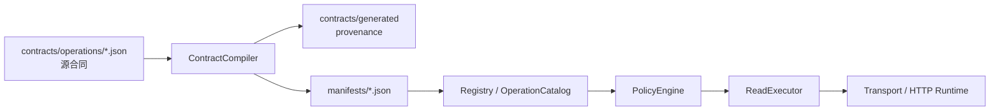

# 扩展地图

本页回答“能力应该加在哪里”。目标是新增最小、原子、可复用的能力，不为一个业务问题复制
客户端、命令树或治理流程。

## 先选择扩展面

| 需求 | 最小扩展面 | 不要做 |
| --- | --- | --- |
| 上游已有可验证的只读接口 | 新增 operation 源合同 | 为每个平台复制 client 或 CLI parser |
| 多个平台只有路由/字段小差异 | 各自原子 operation；共享模型能表达时保持数据化 | 提前抽象一个无法验证的“万能平台层” |
| 共享模型无法表达请求/响应形状 | 小型 codec / projection 扩展 + operation | 把业务口径写进 codec |
| 已有 operation 需要更易用的参数 | 通用 CLI 门面或 Resolver binding | 复制 HTTP 调用逻辑 |
| 调用项目的固定分析 | 项目侧 workspace recipe | 把 App、事件、活动或指标实例提交进 SDK |
| Insight 无法表达的审核聚合 | 项目侧 SQL product | 给 Agent 开放 `execute_sql()` 或新增一次性产品 |
| 异步文件任务 | export route/privacy/blob 合同 | 伪装成普通 read |
| 只在前端 bundle 发现候选路由 | Census draft/reservation | 未验证就提升 stable |
| 只改文档、错误提示或组合流程 | 对应文档/adapter/组合模块 | 制造新 operation 和 live probe |

新增平台通常是新增该平台的原子 operation，而不是新增一套平台 SDK。平台间确有重复时，先
积累两个以上已验证合同，再提取共享 helper；稳定的 `operation_id`、输入和 envelope 不随内部
去重变化。

## 运行时扩展点

优先在左侧扩展：能由 schema 表达的能力只改数据合同。只有共享模型确实无法表达时，才向右
增加 codec 或 runtime 机制。任何 runtime 扩展都必须服务多个已确认能力，或解决无法数据化
的边界；“以后可能用到”不是理由。

当前源码真相：

- operation：`src/gravity_insight/contracts/operations/`
- operation schema：`src/gravity_insight/contracts/schema/operation-v2.schema.json`
- 编译 manifest：`src/gravity_insight/manifests/`（不要手改）
- provenance：`src/gravity_insight/contracts/generated/`
- export：`src/gravity_insight/contracts/exports/`
- workspace/recipe/SQL product schema：`src/gravity_insight/contracts/schema/workspace-v1.schema.json`
- SQL 机制合同：`src/gravity_insight/contracts/sql-products/catalog.json`
- Census：`src/gravity_insight/census/data/`

## 新增原子 operation

1. 用 Census、浏览器或获批 probe 留下可复核的路由和响应形状证据。
2. 选择稳定且窄的 `operation_id`；一个 operation 表达一个读取动作。
3. 在源合同声明固定路由、effect、输入、投影、分页、隐私和最小 probe。
4. 运行 compiler 的正式生成流程，再用 `python -m gravity_insight.compiler check` 验证确定性。
5. 添加脱敏 fixture 和针对该 operation 的输入、投影、分页、错误测试。
6. 离线检查通过后，才按 [探测安全](probing.md) 做最小 live probe。
7. 证据、合同、隐私和 probe 全部成立后再标为 stable。

完整准入和兼容规则见 [新增受控能力](operations.md)。Census 只证明“前端可能调用”，不能
证明请求字段、响应投影、只读性质或当前账号权限。

## CLI 与 Agent 体验

新增命令前先判断现有通用入口能否完成：

- Agent 紧凑发现：`agent`；
- 搜索/描述：`operations search/describe`；
- 一次执行和诊断：`run`；
- 独立并发：`batch read`；
- 跨目录发现：`find`；
- 项目绑定：workspace recipe；
- 本地物理事实：`metadata`。

只有高频领域输入可以明显减少复杂 JSON，且不会嵌入业务语义时，才增加领域门面。门面必须
委托既有 client/resolver，不得重写认证、请求、分页或错误映射。离线命令应显式标记为不需要
网络客户端，避免 `--help`、search 或 check 触发登录。

Python 的 `GravitySDK/connect` 也是薄委托层。新增便利方法时只能转发到已有专用 client，
不得在统一门面里猜 Insight/SQL、复制输入模型或新增一套授权策略；高级能力继续通过
`gravity.insight` / `gravity.sql` 暴露。

所有面向 Agent 的新输出应保持稳定 JSON envelope，至少包含 `schema_version`、`ok`、
`status` 和结构化错误；发现命令还应给出下一条可复制命令或 example。参数细节留给
`--help` 和 `describe`，不要在多个文档复制完整 schema。

## 门禁按风险升级

开发内循环运行目标测试和受影响的确定性检查。提交前仍按仓库要求运行完整门禁。

| 改动 | 内循环最小检查 | 额外硬检查 |
| --- | --- | --- |
| 文档 | `tests.test_documentation`、链接检查、`git diff --check` | 无 live probe / Evidence |
| operation 合同 | compiler check + 该 operation 测试 | 投影/隐私、分页、脱敏 fixture；stable 前最小 probe |
| CLI adapter | 对应 parser/CLI 测试、`--help` | 不得绕过 client/resolver；离线命令不得登录 |
| runtime/认证/并发 | 目标单测 + 完整测试 | 固定路由、刷新 single-flight、重试/限流和敏感信息检查 |
| SQL product 实例 | 项目侧 workspace 校验和 product 目标测试 | 聚合隐私、投影和行数上限；发布 Evidence 时遵循运行手册 |
| Census / Evidence | 对应 maintainer 流程 | 只有显式授权才访问生产或发布 |

硬安全底线保护外部系统、隐私和调用合同；代码行数、全量测试、Census、Evidence 与 live probe
不是每个小改动的前置仪式。不要通过更新 baseline、放宽投影或添加旁路来消除失败；先判断
失败是否与改动风险相关，再在提交前完成对应验证。

## 完成定义

- Agent 能从 `gravity agent` 得到 bounded capability card、必填输入和下一条 argv；
- CLI 与 Python API 走同一实现，独立读取能使用正式 batch；
- 新能力不包含业务实例；未登记字段 fail-closed，已登记且上游授权的用户级字段不再二次隐藏；
- 文档只描述已经实现的命令和限制；覆盖数量以当前 catalog 输出为准；
- 完整门禁通过，diff 中没有凭据、原始用户数据、临时探针文件或手改 manifest。
