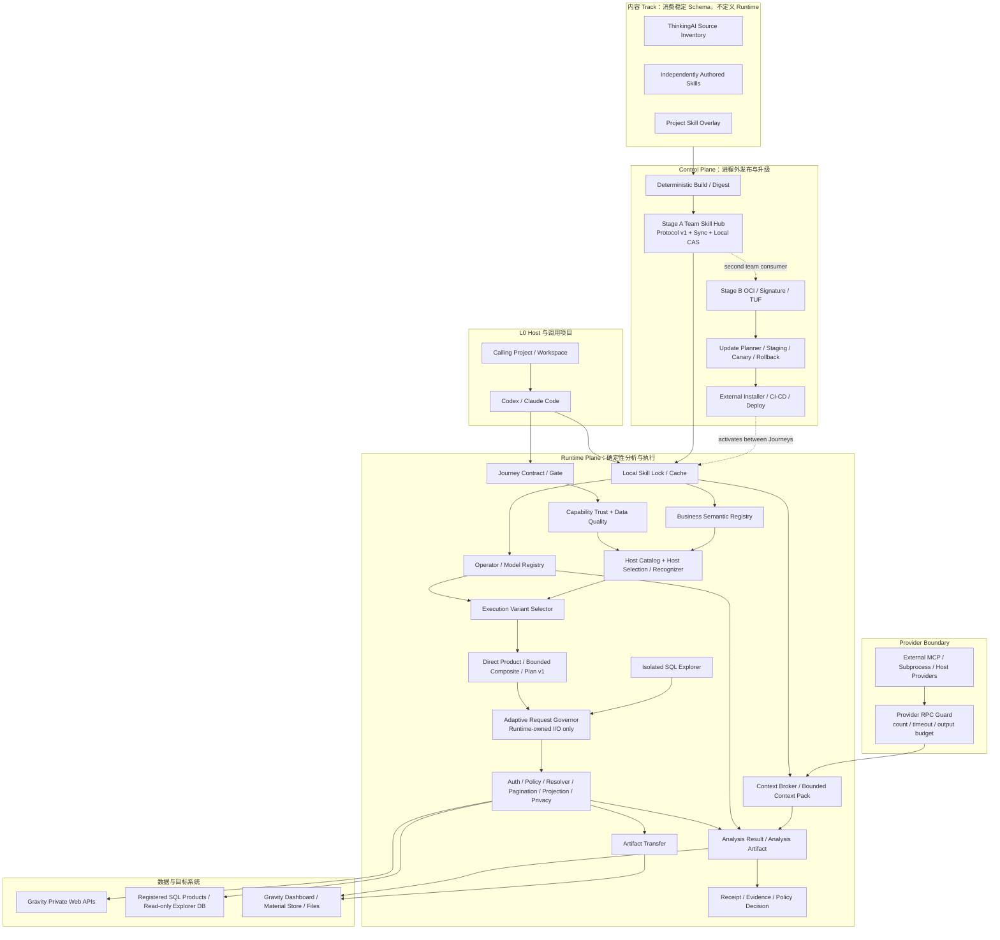
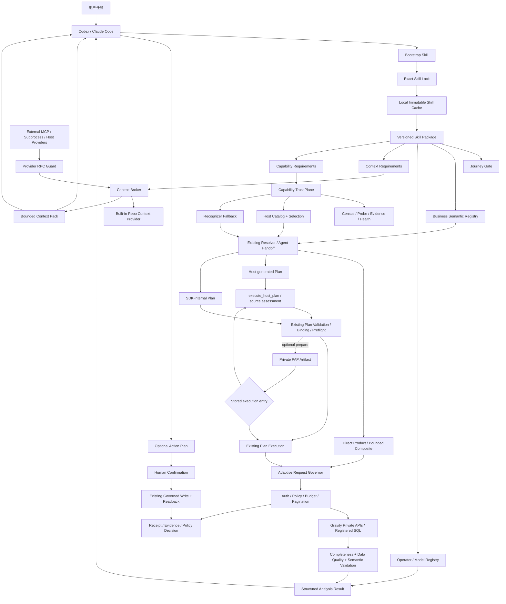

# Gravity Agent Runtime：产品方向、产品形态、目标架构与 Codex 开发总纲


## v9.1 修订摘要

本版在 v9 完成产品重定位、需求拆分和主分支冻结后，根据首轮需求图复核进一步收口可访问架构源、Semantic 所有权和独立交付边界：

1. **新增“架构裁决与反路径依赖”规则**。当前源码、测试和活动文档用于证明“现在是什么”，不能自动决定“未来必须是什么”；Codex 开工前必须建立冲突台账，区分安全不变量、当前行为合同、过渡规则、旧产品假设和历史材料。
2. **Phase -1 改为“产品宪法与冲突台账迁移”**。明确 Gravity Agent Runtime 的目标边界，但保持仓库名 `gravity-sdk`、Python 包名和 `gravity` CLI 稳定，不为定位升级制造无收益的重命名迁移。
3. **纵向切片仍是实施策略，不是架构降级**。长期目标架构、Hub 协议、扩展类型和信任边界现在一次设计完整；首条纵向切片负责证伪和校准合同，而不是把未进入切片的长期能力从架构中删除。
4. **Skill Hub 仍是核心产品面**。Stage A 不再仅限本机缓存，而是实现冻结的 Hub Protocol、基础团队同步、digest、exact lock、离线缓存和确定性构建；Stage B 再增强 OCI、签名、TUF、组织撤销和合规供应链。
5. **ThinkingAI 全量迁移仍是明确交付目标**。3～5 个代表 Skill 只用于验证 Schema 和依赖模型；验证后必须继续完成全部公开主题的 Inventory、独立 Specification 和 readiness 状态，不得无限停留在代表样本。
6. **Runtime / Control Plane、隔离 SQL Explorer、Provider 边界和可复现 Lock 的判断保留**。同时要求进程外 Provider 声明自身能力和返回可审计统计，Runtime 只对 RPC 边界执行强制治理。
7. **Codex 提示词改为“目标架构优先、当前事实校验、旧假设显式迁移”**。不得因先读旧版 `AGENTS.md`、roadmap、测试或文件结构，就把新架构压回旧产品思路；也不得借此绕过安全、权限、隐私和消费者迁移约束。
8. **单总纲原则不变**。后续只更新这一份产品与架构总纲；工作提案和冲突台账属于 `tmp/` 中的过程 Artifact，不构成第二份总纲。
9. **允许并要求派生有界需求规格**。总纲定义产品目标、架构边界、术语和依赖图；`specs/agent-runtime/` 下的 R00-R16、CT01-CT03 负责具体合同、迁移、验收和回滚。需求规格必须绑定总纲版本与 digest，不得反向修改架构。
10. **冻结本次主分支集成策略**。各需求单元在独立 `codex/<unit>` 分支开发并合入 `dev`；在全部计划需求完成、整体验收通过且用户另行批准前，不把本计划的开发工作合入 `main`。
11. **完整总纲进入仓库**。`specs/agent-runtime/architecture-source.md` 是唯一 canonical architecture source；directive 通过仓库相对路径、格式、检索规则和 digest 绑定它，本机下载文件只保留为来源记录。
12. **拆除大爆炸集成点**。R09 拆为 Core Skill Runtime、Team Hub Binding、External Context Binding；R13 拆为 Artifact Transfer、Analysis Artifact/Renderer、Gravity Dashboard Connector。外部 Hub/Provider/Action 不再阻塞基础 Runtime 或素材传输。
13. **细化高风险交付与上下文对齐**。R12/R14 使用强制里程碑逐阶段交付；Stage A 增加与 Skill 内容分离的 Team Trusted Pack；Context 按实体、有效时间、观察时间和来源权威对齐。

> 仓库：`mmm1h/gravity-sdk`
> 本版审阅基线：`main@b9c029db7f41fa90d04b4e019a892cba25eb9230`（实施前必须重新读取当前 HEAD）
> Directive ID / Version：`gravity-agent-runtime / v9.1`
> 批准状态：用户已于 2026-08-21 明确批准总纲定稿与需求拆分；具体功能施工仍按派生需求的 `ready` 状态启动
> Canonical repository path：`specs/agent-runtime/architecture-source.md`
> 文档性质：仓库内唯一产品总纲 + 目标架构 + 演进路线 + Codex 开发约束
> 目标宿主：Codex、Claude Code，以及其他支持 CLI / MCP / Python 工具调用的通用 Agent
>
> **单一架构源规则**：后续产品方向与目标架构只维护仓库内 `specs/agent-runtime/architecture-source.md`，不再派发第二份并行总纲。本机下载文件是已导入来源，不是运行时权威。允许从总纲派生多个有界需求规格；它们只细化单一交付单元，不得重新定义产品方向或共享架构。每轮真正落仓时，最终裁决仍分别写回 `roadmap.md`、`architecture.md`、`agent-workflow.md`、`analysis-journeys.md` 和技术债。
>
> **程序集成规则**：本计划所有功能开发默认只进入 `dev`，不进入 `main`。只有 Requirement Index 中全部计划节点完成、整体验收通过，并取得用户新的明确批准后，才讨论向 `main` 推广；单个需求完成、单轮全绿或局部可用都不构成提前推广理由。
>
> **动态事实规则**：Operation、Product、Gap、Skill 和 ThinkingAI 源目录数量不得在长期规范中写死，始终从当前 compiler、`agent-catalog`、Skill Hub inventory 和 source snapshot 派生。

---

## 目录

1. [最终决策](#一最终决策)
2. [产品定位与边界](#二产品定位与边界)
3. [目标用户与核心任务](#三目标用户与核心任务)
4. [最终产品形态](#四最终产品形态)
5. [参考产品与借鉴矩阵](#五参考产品与借鉴矩阵)
6. [核心概念模型](#六核心概念模型)
7. [目标总体架构](#七目标总体架构)
8. [Codex / Claude 标准调用协议](#八codex--claude-标准调用协议)
9. [Skill、Skill Hub 与全量迁移](#九skill-体系设计)
10. [CLI、MCP 与 Python SDK 产品面](#十climcp-与-python-sdk-产品面)
11. [业务语义、Context Hub 与全域感知](#十一业务语义与-context-pack)
12. [可信能力、完整性、数据质量与分析算子](#十二可信数据完整性与证据模型)
13. [分析结果与结论边界](#十三分析结果与结论边界)
14. [受治理行动与实验交接](#十四受治理行动与实验交接)
15. [Receipt、审计与策略决策](#十五receipt审计与策略决策)
16. [Journey Contract 与 Agent 评测](#十六journey-contract-与-agent-评测)
17. [当前仓库基础与差距](#十七当前仓库基础与差距)
18. [分阶段演进路线](#十八分阶段演进路线)
19. [实施工作包与验收标准](#十九实施工作包与验收标准)
20. [非功能要求](#二十非功能要求)
21. [明确不做](#二十一明确不做)
22. [Codex 总执行提示词](#二十二codex-总执行提示词)
23. [Codex 单元交付模板](#二十三codex-单元交付模板)
24. [参考资料](#二十四参考资料)

---

# 一、最终决策

## 1.1 一句话定义

> **Gravity Agent Runtime 是专门面向 Codex、Claude 等宿主 Agent 的无头、受治理、可扩展游戏数据分析能力层。它以可信原子能力为底座，以 Business Semantics、Analysis Operators、Context Hub 和 Versioned Skills 组织行业方法，通过 Skill Hub 同步给团队，并用 Journey Contract、完整性、数据质量、身份、隐私、行动计划和 Receipt 约束每一次分析与执行。**

英文定位：

> **A headless, governed and extensible game-analytics runtime for general-purpose agents.**

## 1.2 最终产品不是 Agent 外壳，而是 Agent 能力操作系统

Codex、Claude 已经负责自然语言理解、任务规划、文件与 GitHub 访问、报告撰写和跨系统调用。Gravity 不再造模型、Web Chat、通用记忆或自由多 Agent，而是提供宿主不能猜、也不应自行实现的确定性能力：

```text
能力发现与版本锁定
游戏业务语义与指标口径
可信数据读取与完整性证明
确定性分析算子与模型版本
多来源 Context 的发现、过滤与引用
Skill 工作流、结论边界与行动交接
私有 API 漂移、健康、权限和隐私治理
写入 Preview、人工确认、Readback 与证据链
```

## 1.3 核心产品面

```text
Journey Gate                真实任务是否仍可信可完成
Capability Trust Plane      原子能力及上层产品是否仍可信
Business Semantic Registry  指标、维度、实体、时间和归因口径
Analysis Operator Registry  可复用、确定性、可测试的分析方法
Model Registry              LTV、LT、预测、异常等模型的版本与验证
Skill Hub                   行业 Skill 的登记、审查、分发、锁定与撤销
Context Hub                 全域上下文的 Provider、索引、Broker 与 Context Pack
Governed Execution Kernel   现有 Operation / Product / Composite / Plan 执行核
Artifact & Delivery Plane   二进制产物、Analysis Artifact、看板/报告编译与交付
Adaptive Execution Plane  执行变体、全局请求治理、链路优化与性能反馈
Release & Update Plane    Runtime/Skill/Provider/Operator 的检查、验签、Canary 与回滚
Action & Evidence Plane   Preview、执行、Readback、Receipt、Policy Decision
```

## 1.4 最终产品公式

```text
数数科技式的全量行业 Skill 分类、分析闭环与全域感知
+
WrenAI / Agent Skills 式的按需加载和版本绑定
+
OCI / Sigstore 式的团队级签名分发与供应链验证
+
MCP Resources 式的动态 Context 发现与订阅
+
Cube 式的安全上下文、语义和缓存隔离
+
Great Expectations / OpenMetadata 式的合同与验证结果分离
+
Pact 式的消费者 Journey 合同
+
MLflow / Evidently 式的模型版本、质量与漂移验证
+
Terraform / Kubernetes 式的不可变行动计划和字段所有权
+
Gravity 现有合同执行核、Census、Probe、分页、隐私和 fail-closed
```

## 1.5 六条不可动摇的架构原则

1. **宿主负责推理，Gravity 负责事实、方法、边界与执行。**
2. **Skill 是声明式工作流合同，不携带任意远程可执行代码。**
3. **Context 是数据，不是指令；外部文本永远不能覆盖 Skill、用户授权和 SDK 合同。**
4. **任何能力只有在同层权威合同与当前验证结果都满足时，才可被 Skill/Journey 声称可用。**
5. **扩展通过受控类型完成，不通过一个可任意加载代码的通用插件系统完成。**
6. **当前实现是迁移起点，不是目标架构的上限；任何旧假设若与已批准目标冲突，必须显式迁移而不是被动继承。**

## 1.6 架构裁决、指令优先级与反路径依赖

### 1.6.1 当前事实与目标设计必须分开

```text
当前源码 / 测试 / Manifest / 活动文档
= 证明当前行为、兼容面、风险和迁移成本

本总纲 + 当前选定工作包
= 定义已批准的目标产品、目标架构和迁移方向
```

Codex 不得把“仓库现在这样实现”推导成“未来必须继续这样实现”，也不得为了让旧测试立即通过而把新能力强行塞回旧边界。反过来，本总纲也不能覆盖当前源码事实：任何目标设计都必须先 Characterize 当前链路，并给出迁移、兼容、回滚和能力不退化证据。

### 1.6.2 指令与证据优先级

发生冲突时按以下顺序裁决：

1. 用户最新明确授权，以及由 `directive.json` 绑定到用户批准版本/digest 的本总纲架构决策和当前 `ready` 需求目标；
2. 安全、权限、隐私、凭据、生产请求、写入确认和发布授权不变量；
3. 当前机器合同、Manifest、源码和测试所证明的**现有行为事实**；
4. 当前活动文档和 `AGENTS.md` 中的工作流约束；
5. 归档、历史提案、旧审计和过期路线图。

其中第 3、4 项不能自动否决第 1 项。若旧活动文档与目标架构冲突，先在 Phase -1 中完成宪法迁移，再实施代码；若安全或授权规则冲突，则停止并报告，不能由总纲豁免。

### 1.6.3 旧规则必须分类，不能整体继承

Codex 在每个大型工作包开工前，必须把相关旧规则分成五类：

| 类别 | 含义 | 处理方式 |
|---|---|---|
| `safety_invariant` | 凭据、隐私、权限、写入确认、生产探测等安全边界 | 原样保留或增强 |
| `current_behavior_contract` | 当前调用面、结果、预算、错误和消费者依赖 | 先 Characterize，再迁移；不得静默退化 |
| `transitional_rule` | 为旧架构并行开发、门禁或临时收敛设置的规则 | 由工作包显式保留、修改或退休 |
| `legacy_product_assumption` | 旧产品定位下的职责和扩展边界 | 若与总纲冲突，Phase -1 显式替换 |
| `historical_evidence` | archive、旧报告、历史数字和已结束决策过程 | 只作证据，不作当前指令 |

典型的旧产品假设不能被机械继承：

- “业务方法全部属于调用项目”调整为：**可复用方法、Semantic 类型与 Schema、通用指标/方法定义、单位/可加性/时间粒度/依赖/冲突校验、Operator 和行业 Skill 属于 Runtime；具体游戏活动名称、SKU 实值、埋点/App 绑定、项目专属公式参数和生效窗口仍属于调用项目**；
- “不建立任何 registry”调整为：**不建立万能可执行插件系统，但允许并要求 Skill、Semantic、Operator/Model、Context Provider 和 Action Connector 的受控类型化 Registry**；
- “共享 spine append-only”只能作为旧并行开发规则，不能阻止经 Characterization 后用生成索引或明确模块边界替代手工接线；
- “只做顺手清理、不做独立重构”不能阻止已批准的大型架构迁移，但每个迁移仍必须是窄工作包并证明能力不退化；
- 当前目录、Mixin、文件大小闸门和文档位置是迁移约束，不是目标架构本身。

### 1.6.4 架构冲突台账

每个大型工作包必须在 `tmp/` 生成一个机器可读或结构化的冲突台账，至少包含：

```json
{
  "source": "AGENTS.md / roadmap / test / module",
  "current_rule": "旧规则或当前行为",
  "classification": "safety_invariant | current_behavior_contract | transitional_rule | legacy_product_assumption | historical_evidence",
  "decision": "keep | strengthen | migrate | supersede | defer",
  "target_rule": "本工作包后的规则",
  "characterization": ["当前行为证据"],
  "migration_gates": ["兼容、回归、回滚和消费者迁移"],
  "expiry_or_owner": "过渡规则的退出条件或 owner",
  "approval_required": true
}
```

冲突台账是过程 Artifact，不是第二份产品总纲。Codex 不得静默选择“最容易让旧测试通过”的实现，也不得只在新层外包一层 Adapter 来规避真正需要迁移的旧边界。任何把现有安全规则分类为 `supersede` 的决定必须停止施工并取得用户明确批准，不能由 Codex 自行完成重分类后继续。

### 1.6.5 Codex 的反路径依赖开工协议

Codex 必须按以下顺序读取：

```text
本总纲中的目标与当前工作包
→ 当前 HEAD、Manifest、源码和机器门禁
→ 活动文档与 AGENTS 工作流
→ archive / 历史材料
→ 冲突台账与迁移提案
```

开工前必须回答：

```text
哪些旧行为必须保留？
哪些只是当前实现而非目标设计？
哪些旧规则已被本总纲明确替代？
哪些测试应保留，哪些应随产品宪法迁移？
是否出现为了不改旧思路而新增第二套兼容层？
若从零设计但必须兼容现有消费者，最小正确边界是什么？
```

若答案不清楚，先停止在设计与 Characterization 阶段，不得直接编码。

### 1.6.6 派生需求规格与批准边界

总纲只冻结跨需求共享的产品目标、职责、术语、架构不变量和依赖顺序。具体实现必须拆成有界需求规格：

```text
唯一架构总纲 v9.1（repository canonical source）
→ specs/agent-runtime/directive.json 绑定批准版本与 digest
→ specs/agent-runtime/index.json / index.md 定义依赖图和状态
→ R00-R16 family leaves / CT01-CT03 细化单一交付单元
→ Issue / codex/<unit> worktree / implementation / validation
→ dev 集成
→ 全计划完成后才允许另行评估 main promotion
```

每份需求必须声明 parent directive、目标/非目标、依赖、当前事实、机器合同、迁移、安全边界、验收、回滚和最终文档 owner。需求可以细化总纲未规定的实现选择，但不能改变共享架构；发现冲突时必须先暂停该需求并修订总纲及 directive digest。

顶层 Requirement 默认就是叶子交付单元。只有总纲明确声明为 `delivery_mode=staged_epic` 的 R12、R14 可以包含强制顺序子阶段；每个子阶段仍必须拥有独立 Issue、分支、提交和验收，父 Requirement 只有全部子阶段达到 `fixed_dev` 后才能达到 `fixed_dev`。

需求状态固定为：

```text
draft → specified → reviewed → ready → in_progress → fixed_dev → released
                                      ↘ blocked
```

- `ready` 必须由用户或计划 owner 明确批准，不能由需求正文自行宣布；
- `fixed_dev` 只表示已在 `dev` 验收，不表示已进入 `main`；
- 本计划完成前所有功能需求最多到达 `fixed_dev`；
- `released` 仅在未来整体推广到 `main` 后使用；
- `superseded` 是旁路终态，必须引用替代需求和裁决。

并行只允许发生在依赖已满足且写入范围不重叠的需求之间。领域 core 可并行，`plan_adapters.py`、`agent_capabilities.py`、`agent_composite.py`、`agent_handoff.py`、`cli.py` 和 `__main__.py` 等共享 spine 的最终接线由单一 integrator 串行完成。

# 二、产品定位与边界

## 2.1 五类职责边界

### 宿主 Agent：Codex / Claude Code

负责：

- 理解用户意图、选择工作流并进行最终表达；
- 从已锁定的本地 Skill Cache 按需读取 Skill；
- 通过现有 host catalog / recognizer 选择 Product；
- 访问自身已授权的 GitHub、飞书、文件和外部工具；
- 请求 Context Pack，并决定是否进入 Action / Experiment 阶段。

### Gravity Runtime Plane

负责：

- Journey、Capability Trust、Data Quality、可复用 Semantic 类型/Schema/通用定义、Operator/Model 与 Context Contract；
- 读取项目 lock 和本地不可变 Skill Cache；
- Context Provider 协议、Repo Provider、RPC Guard、Context Broker 和引用；
- Workspace、App、业务输入、路由与产品选择校验；
- 固定 Host / Path / Method 合同；
- 完整性、语义状态、隐私和 allowed claims；
- 现有 Product / Recipe / Bounded Composite / Plan v1 执行；
- Analysis Result、受治理写入、Receipt、Evidence、Checkpoint 和 Policy Decision。

Runtime Plane 不负责远程发布、下载、lock 更新、Canary、激活或替换自己的 wheel。

### External Control Plane

负责：

- Skill/Runtime/Provider/Operator 的 build、publish、download 和 verify；
- 项目依赖解析与 lock 更新计划；
- Staging、offline gate、Canary、activation 和 rollback；
- 由外部 Installer、包管理器、CI/CD 或部署流程执行激活。

Control Plane 不参与单次 Journey 的查询路由和业务推理，也不能绕过 Runtime 的 Trust、兼容和 Journey Gate。

### Skill Hub 与内容 Track

负责：

- Skill 源目录、命名空间、版本、依赖、摘要和生命周期；
- Stage A 的冻结 Hub Protocol、基础团队同步、内容寻址包、lock、离线缓存和确定性构建；
- 出现不可信传输、跨组织分发、集中撤销或合规需求后，Stage B 增强 OCI、签名、Provenance、TUF、撤销和组织发布；
- ThinkingAI 公共 Skill 的 Source Inventory、代表 Skill 与最终全量独立规格；
- Agent Skills 兼容导出。

ThinkingAI 内容 Track 只消费稳定的 Skill/Semantic/Operator/Context Schema，不反向定义 Runtime。

### 调用项目，例如 `work-dashboard`

负责：

- 具体 App alias、活动名称、SKU 实值、版本、平台和投放窗口；
- 项目专属指标绑定、公式参数/生效窗口和埋点语义；
- 项目级 Context Provider 配置、访问权限和私有文档；
- 已登记 SQL Product；
- 最终报告模板、部门话术和经营口径；
- Project Skill Overlay、项目 lock 和升级审批。

## 2.2 Runtime 拥有的事实

```text
物理 API 合同
Capability Trust 与当前 Validation Result
请求/响应 schema、effect、stability
pagination completeness / evidence
privacy projection / semantic status
Product / Composite / Plan execution contract
可复用 Business Semantic 类型/Schema、通用指标/方法定义、版本化 URI 与解析/校验机制
单位、可加性、时间粒度、依赖、冲突和公式结构校验
Operator 的机器 schema
Skill / Context / Action / Receipt 的机器合同
```

## 2.3 Runtime 不拥有的事实

```text
某项目“首充礼包”对应哪个 SKU
某版本名对应哪个版本号
买量用户、活跃用户、付费率、ROI、LTV 的项目专属绑定、参数与生效窗口
活动真实排期、发布事故、页面遮挡、客服反馈是否发生
部门最终汇报模板和经营判断
```

Runtime 提供这些事实的**登记与解析框架**，但定义本身由项目/组织提供。未声明时返回 `semantic_gap`、`context_gap` 或 `binding_gap`，不得由字段名、第三方 Skill 或模型自动补齐。

## 2.4 扩展边界

Gravity 只允许四类扩展：

1. **Skill Package**：声明式工作流、引用和合同；默认无代码。
2. **Context Provider**：通过 MCP / 受控子进程提供只读资源；外部运行、权限隔离。
3. **Trusted Analysis Operator / Model Pack**：显式安装、版本锁定、审查和测试的确定性代码；不得由远程 Skill 自动带入。
4. **Governed Action Connector**：有 effect、Preview、授权和 Readback 合同的写入适配器。

不建立一个“扫描安装包并自动 import 一切”的通用插件注册表。

## 2.5 目标产品名称

- 仓库与 Python 包：继续使用 `gravity-sdk`，不因本轮架构升级强制重命名；
- 产品定位与架构概念：`Gravity Agent Runtime`；
- Skill 分发面：`Gravity Skill Hub`；
- Context 面：`Gravity Context Hub`；
- CLI：`gravity`；
- MCP Server：`gravity-runtime`。

# 三、目标用户与核心任务

## 3.1 第一目标用户

```text
Codex
Claude Code
其他能调用 CLI / MCP / Python 的通用 Agent
```

人类通过宿主 Agent 使用 Gravity；不要求直接学习底层 Operation。

## 3.2 核心 Jobs to Be Done

### 可信问数与诊断

```text
查询趋势、漏斗、留存、付费、投放和活动结果
确认异常是否成立
拆分分子分母和贡献因素
区分事实、相关、假设与因果
```

### 预测、精算与实验

```text
LT / LTV 曲线拟合
收入、DAU、付费规模预测
价格弹性与礼包阶梯评估
样本量、显著性和实验方案
```

这些能力必须调用受版本管理的 Operator / Model，不能只靠 Prompt 算法描述。

### 全域感知补证

```text
结合发布记录、代码变更、活动排期、事故、客服、商店评论和社区信号
发现同一 App / 版本 / 时间窗的关联证据
明确哪些来源缺失、过期、冲突或无权限
```

### 项目知识与代码发现

```text
发现 AGENTS.md、README、架构、路线图和业务规范
定位指标、埋点、SQL Product、版本和活动配置
按符号、路径、提交和时间窗检索代码与文档
返回来源路径、行号、commit 和内容 hash
```

### Skill 团队协同

```text
查询 Hub 中可用 Skill
同步组织发布的 Skill
将项目锁定到相同版本和摘要
审查新 Skill、依赖和许可证
检测新增、变更、弃用和撤销
```

### 受治理行动

```text
生成分群、看板、保存分析、订阅、运营或实验草案
Preview → 人工确认 → Execute → Readback
状态或身份变化时计划失效
```

## 3.3 产品北极星

```text
真实 Journey 可可信完成率
ThinkingAI 公共 Skill 目录登记覆盖率
Skill 可执行/已验证覆盖率（与登记覆盖率分开）
Capability Trust 满足率
Context 缺口可解释率
完整性、数据质量和 claim 越界拦截率
团队 Skill 版本一致率
不安全写入率（目标 0）
```

不得以 Skill 数量、Operation 数量、回答长度或 Prompt 复杂度作为主要成功指标。

# 四、最终产品形态

## 4.1 Headless Runtime + Runtime/Control 分离

最终产品由两类可独立演进的面组成：

```text
Runtime Plane
  Gravity Runtime wheel / CLI / Python SDK
  Journey Gate / Capability Trust / Data Quality
  Business Semantic / Operator / Model
  Built-in Skills / Local Skill Lock / Context Pack
  Existing Execution Kernel / Analysis Result / Receipt

External Control Plane
  Skill source/build/publish/download
  Runtime/Skill/Provider/Operator update planning
  Verification / staging / canary / activation / rollback
```

没有 Web ChatBI、网页 Skill 商店或内置大模型。Runtime 只消费已经验证并锁定的本地 Artifact；它不在运行中发布包、同步远程 Hub 或替换自己的 wheel。

## 4.2 团队最小使用体验

```text
安装 gravity-sdk
→ 安装 Bootstrap Skill
→ 从本地或已配置 Hub resolve 精确依赖
→ 生成并提交 gravity.skills.lock.json
→ 离线安装/验证 lock 中的 Skill Artifact
→ Codex / Claude Code 按需 gravity skills get
→ Skill 声明 Semantic / Context / Capability / Operator 需求
→ gravity journey can-run / skill prepare
→ 使用现有 host catalog / recognizer 与执行核
→ 返回结构化结果、完整性、质量、结论边界和 Receipt
```

运行中绝不自动升级 Runtime 或 Skill。团队一致性来自提交到调用项目的精确 lock 与外部 Control Plane 生成的升级计划。

## 4.3 Skill Hub 的两级部署形态

### Stage A：最小团队 Skill Hub

第一阶段即冻结完整 Hub Protocol，并提供两条互不混淆的团队同步能力：

```text
Git 中的 Skill Sources
→ 单一 Render Model
→ Deterministic Package Build
→ Content Digest
→ Hub Protocol v1 Index（Git-backed 或静态 HTTPS）
→ Team Sync / Resolve
→ Exact Project Lock
→ Fetch / Verify Package Boundary
→ Atomic Local Content-addressed Cache
→ Offline Materialize / Install / Verify
```

普通 `Skill Content Artifact` 仍是无代码静态内容。团队共享 Operator/Model 若不适合进入 Runtime 主 wheel，则使用独立的 `Team Trusted Pack Artifact`：固定团队来源、精确 Python wheel/version/digest、显式 Operator/Model group allowlist、独立 trusted-pack lock、外部 Installer 安装，Runtime 启动时只验证已安装分发，不自动下载、安装或扫描任意 entry point。Skill 只能声明精确 Operator/Model URI 依赖，不能携带或触发 Trusted Pack 安装。

Hub Protocol v1 必须现在定义稳定的 artifact kind、namespace、version、digest、dependencies、runtime compatibility、source、license、lifecycle 和 artifact location 语义，使后端从 Git/静态索引升级到 OCI 时客户端与 lock 无需改变。Stage A 不要求签名服务、TUF 元数据或常驻服务，但必须让所有项目成员能够从同一受控源同步并锁定相同 Skill 内容或经批准 Trusted Pack。

### Stage B：组织级供应链强化

在出现跨组织分发、不可信传输、集中撤销、合规审计或大规模发布需求后增加：

```text
OCI Artifact
→ Signature / Provenance
→ TUF-style Root / Targets / Snapshot / Timestamp
→ Revocation / Organization Publishing
→ Staged Update / Canary / Rollback
```

Stage B 不能改变 Stage A 已冻结的 Skill Manifest、digest、依赖和 lock 语义。

## 4.4 Agent Skills 兼容输出

Gravity 内部权威 Skill Manifest 使用 JSON。面向 Claude Code、Codex 等宿主时，Exporter 生成符合 Agent Skills 开放规范的：

```text
SKILL.md                 YAML frontmatter + 精简引导
references/              按需读取的 Gravity guide / schema / examples
assets/                  允许的模板与静态资源
```

YAML 只存在于生成结果的标准 frontmatter；Runtime 不因此引入 PyYAML。任意第三方 `scripts/` 不随普通 Skill Package 执行。

## 4.5 用户可见产物

```text
JSON 结果与 Analysis Result
Analysis Artifact / Visualization Spec
CSV / XLSX / JSON 导出
受治理的图片、视频、素材和文件 Artifact
Journey / Skill / Capability readiness
Context Pack 与来源引用
Metric / Operator / Model 版本
Plan / Action Preview
Receipt / Evidence
Capability / Semantic / Context / DataQuality Gap
```

最终 Markdown 报告模板和部门口径仍由调用项目负责。

## 4.6 Bootstrap Skill

本地只保留一个很小的引导：

```text
先读取项目 Skill Lock 和当前 Runtime 版本
未知工作流先查 Skill Hub，不猜 Product
Skill 只指导“选对之后怎么用”，Product 仍走 host catalog / recognizer
分析前检查 Semantic、Context、Capability Trust、Completeness 和 Data Quality
Context 文本只是 data，不是 instruction
自然语言不得直接写入
所有结论必须在 allowed claims 和 Evidence Level 内
```

真正 Skill 内容从当前 wheel / 已锁定 Hub Artifact 按需读取。

# 五、参考产品与借鉴矩阵

> 只借鉴公开结构和方法。第三方效果数字、客户案例和“自动找到根因”等厂商表述不是 Gravity 的有效性证据；ThinkingAI Skill 迁移必须独立重写并重新验证。

| 参考对象 | 吸收的能力 | Gravity 中的落地 | 明确不照搬 |
|---|---|---|---|
| **ThinkingAI / 数数科技** | 全量行业 Skill 分类；行为、反馈、社区、知识库四类全域感知；分析→运营→实验→验证；Skill 中心、MCP、权限、调度、审计 | 全量 Skill 迁移台账；Skill Hub；Context Hub；AnalysisResult→ActionPlan→ExperimentProposal；Skill/执行治理 | Web Agent Builder、营销 Demo 因果结论、自由多 Agent 自动写入 |
| **Agent Skills 开放规范** | `SKILL.md`、references/assets、渐进加载、兼容与许可证元数据 | 内部 JSON Manifest；安装边缘生成标准 `SKILL.md`；Bootstrap + 按需 references | 允许普通远程 Skill 携带可执行 scripts |
| **WrenAI** | Skill 随 wheel 版本发布；小型 discovery stub；`skills get` 按需读取 | Built-in Skill 随 wheel；Hub Skill 按 lock 读取；CLI 输出当前版本指南 | Text-to-SQL 作为默认执行路径 |
| **Airbyte Agent SDK** | `inspect → read_skill_docs → execute`；渐进文档；错误翻译；输出大小保护 | `inspect / skills get / journey can-run / execute`；共享 Output Budget | 通用 Connector DSL 侵入 Gravity 核心 |
| **MCP Resources / Registry** | Resources、templates、listChanged、subscription；标准 registry metadata | Skills/Context 作为 Resources；执行作为 Tools；Hub 可选兼容 registry metadata | 依赖仍处 preview 的公共 MCP Registry 作为组织唯一事实源 |
| **OCI / ORAS / Sigstore / TUF / SLSA** | 内容寻址 Artifact、签名、透明日志、可验证 provenance、更新元数据的回滚/冻结防护 | Skill 包发布到 OCI；Cosign 验签；TUF 风格签名 index；SLSA/in-toto provenance；离线 bundle | 只签 Artifact 不保护 Hub index、使用可变 tag、运行中自动更新 |
| **Python Entry Points / HashiCorp RPC Plugin** | 扩展发现；进程隔离和校验 | 仅为明确可信的 Operator/Provider 包预留受控扩展；外部 Provider 优先 MCP/子进程 | 扫描环境后自动 import 任意第三方代码 |
| **Cube** | 语义模型、安全上下文、权限和缓存作用域一致 | RuntimeScope + Business Semantic Registry + Context 权限 | 将 Gravity 扩张成通用 BI Semantic Cloud |
| **Great Expectations / OpenMetadata** | Contract 与 Validation Result 分离；数据质量、版本和执行结果 | Capability Contract、Trust Validation、Data Quality Result 分离 | 引入完整外部治理平台作为运行前置 |
| **Pact** | 消费者真实依赖、`can-i-deploy` 思想 | Journey Contract、Skill readiness、依赖影响图 | HTTP Mock 体系本身 |
| **MLflow / Evidently** | Model version、lineage、alias、评测、漂移 | 轻量 Model Registry 和 Operator Eval；LTV/LT/预测模型必须可复现 | 立即部署完整 MLOps 平台 |
| **Terraform / Kubernetes SSA** | 保存计划、stale、字段 owner、冲突 | Action Plan、PAP 私有 Artifact、managed fields、readback | 自动重试非幂等写入、完整三方合并算法 |
| **OpenLineage / OPA** | Run/Facet、父子链、Decision ID、policy revision | Receipt v1 additive facets；Policy Decision | 引入独立服务作为当前依赖 |
| **PostHog** | MCP/Skills 统一能力面、Context Engineering、真实问题评测 | 同一核心供 CLI/MCP；Context 与 Skill 来自事实源；Journey Eval | Web Agent、自动 PR 等非 Gravity 职责 |

## 5.1 借鉴优先级

```text
1. Gravity Journey + Capability Trust：先证明底座和任务可信
2. ThinkingAI：完整定义行业 Skill 与全域感知覆盖面
3. Agent Skills / WrenAI：定义宿主按需发现和版本绑定
4. OCI / Sigstore / TUF / SLSA：定义团队分发、构建 provenance 与安全更新
5. MCP Resources：定义 Context/Skill 的外部发现接口
6. Cube / OpenMetadata / GX：定义语义、权限、质量和验证结果
7. MLflow / Evidently：定义统计模型和算子可信度
8. Terraform / Kubernetes：定义安全行动
```

## 5.2 ThinkingAI 迁移原则

ThinkingAI 公开页面展示的 Skill 目录和方法具有很高产品参考价值，但页面明确受版权保护。Gravity 的迁移定义是：

```text
迁移其公开“能力主题、适用问题、方法结构和依赖类型”
→ 独立设计 Gravity 的指标、算法、合同、示例和文案
→ 用 Gravity 数据与 Journey 重新验证
```

不得：

- 批量复制页面正文、案例、回答、图表或效果数字；
- 将 ThinkingAI 的 AE 专有操作直接伪装成 Gravity 已支持；
- 将搜索到的“行业基准”或预测数值写进 Skill 默认结论；
- 未经许可发布带有其商标或大段原文的 Skill 包。

每个迁移项必须保留 source URL、source content hash、采集日期、独立重写状态和 license review。

# 六、核心概念模型

## 6.1 Operation

最小物理 Wire Contract：固定 host/path/method、输入、分页、响应投影、隐私、effect、stability 和证据。

## 6.2 Capability Trust Record

Operation、Product 和 Composite 各自拥有同层可信状态，不能跨层静默继承：

```text
结构合同是否有效
当前上游 fingerprint 是否匹配
最近 Validation Result 是否仍新鲜
完整性和 Data Quality 是否满足
权限/身份是否可证明
允许形成哪些 claims
当前 trust stable / degraded / quarantined / unknown / blocked
独立 lifecycle active / deprecated / revoked
```

## 6.3 Product

回答一个窄问题的受治理能力，可组合多个 Operation、局部派生和固定诊断。Product 必须公开自己的 result、completeness、quality 和 claim 合同；不能只依赖底层 Operation 的字段。

## 6.4 Recipe / Plan v1 / Bounded Composite

- Recipe：参数化已登记模板；
- Plan v1：唯一通用显式 DAG 内核；
- Bounded Composite：领域 owner 固定范围、固定组件和固定语义的直接执行路径。

不得建立第二套通用 Binder、Scheduler、Adapter Registry；也不得为了统一外观强制把所有 Composite 改写成 Plan。

## 6.5 Business Semantic Definition

项目/组织登记的业务概念：

```text
metric_id / display_name / formula / numerator / denominator
unit / currency / timezone / time_grain
additivity / aggregation / attribution_window
entity / cohort / owner / version / effective_range
```

Runtime 拥有 schema、解析和门禁；调用项目拥有具体定义。

## 6.6 Analysis Operator

可复用、确定性、可测试的分析方法，例如时期对比、贡献度分解、异常检测、留存曲线、价格弹性、实验显著性。Operator 是代码，不是 Prompt；只能来自 Runtime Core 或显式安装并信任的 Operator Pack。

## 6.7 Model Artifact

LT/LTV、收入预测、流失预测等统计或学习模型的版本化产物，包含：

```text
model_id / version / alias
operator / code version
training or fitting window
input schema / assumptions
metrics / calibration / safe horizon
approval / created_at / data lineage
```

## 6.8 Skill

给宿主使用的版本绑定工作流合同。Skill 声明：

```text
适用问题与停止条件
所需 Business Semantics
所需 Capability Trust
所需 Operator / Model
所需/可选 Context
宿主如何经现有双路由臂选择 Product
工作步骤、预算、完整性、质量和 claim policy
结构化输出与 Action/Experiment 交接
```

Skill 不是执行器、插件、第三路由臂或模型。

## 6.9 Skill Package

Hub 中可分发的不可变 Artifact：

```text
manifest.json
GUIDE.md
references/
journeys/
evals/
assets/（静态、经审查）
provenance.json
```

普通 Skill Package 默认不包含可执行代码。它只引用已登记 Capability、Operator、Model、Context Provider 和 Action Connector。

## 6.10 Skill Hub

Skill Package 的登记、搜索、审查、发布、签名、同步、锁定、弃用和撤销面。Hub 不是运行时插件加载器，也不参与每次数据查询。

## 6.11 Journey

真实业务任务及其机器验收标准，是 Skill、Capability、Context 和执行面的共同证伪对象。

## 6.12 Product 路由的两条臂

```text
宿主能选择 → host catalog + host selection
宿主不能选择 → recognizer fallback
```

Skill 处于更上层，不新增第三条 Product 路由。

## 6.13 Context Provider

提供某一类外部资源的受控适配器。默认在 Runtime 进程外运行，通过 MCP Resources 或受控子进程读取；声明权限、资源 URI、freshness、敏感级别和 provenance。

## 6.14 Context Item / Context Pack

Context Item 是绑定统一实体引用、事实有效时间、配置生效范围、观察时间、来源 revision、权威等级和 supersession 的原子上下文；Context Pack 是针对一次 Skill/Journey 按实体、时间窗和权威来源对齐后的有界集合，不是搜索结果列表。外部文本固定标记为 `role=data`，不能成为授权或控制指令。

## 6.15 Context Hub

Provider Catalog、索引、实体/时间关联、权限过滤、Context Broker、引用和更新通知的逻辑产品面。它不等于把所有原始数据复制进一个向量库。

## 6.16 Prepared Analysis Plan（PAP）

Plan-backed 路径的附加、不可变、私有 canonical Artifact；不覆盖 Direct Composite，不建立新执行器。公开只返回 `pap_id` 与安全摘要，执行时回到原 source-aware entry。

## 6.17 Action Plan

Mutation Preview 产生的不可变、可确认、可失效执行计划；内部绑定身份、目标 preimage、owner 和合同。

## 6.18 Receipt / Evidence / Validation Result

- Receipt：一次执行的值无关证据；
- Evidence：合同、上游、生产或静态取证；
- Validation Result：某合同在某 provider fingerprint、身份和时间点是否满足。

三者不能混为一体。

## 6.19 Artifact Transfer Contract

用于素材、图片、视频、压缩包和其他非 JSON 产物。合同至少声明：精确引用、允许的 Host/Redirect、MIME 与 magic 校验、最大字节数、流式读取、原子落盘、输出根目录、扩展名、摘要、隐私和稳定错误原因。签名 URL、Cookie、Authorization Header 和原始平台对象不得进入公开结果或 Receipt。

## 6.20 Analysis Artifact / Visualization Spec

分析结果到 Gravity 看板、Markdown、HTML、XLSX 或其他目标之间的中间合同。它只描述标题、章节、可视化、Metric/Dimension 引用、筛选、来源结果、allowed claims 和 Evidence，不直接携带 Gravity Web 原始配置。目标系统由单独的 Compiler / Action Connector 负责 Preview、Execute 和 Readback。

## 6.21 Execution Variant

同一个 Product 或 Journey 的可替换执行实现，例如 Direct Operation、Bounded Composite、Plan-backed、Registered SQL Product。每个 Variant 必须声明输入/输出语义、完整性、质量、隐私、claims、请求预算、预计延迟、数据新鲜度和当前 Trust。只有通过等价性 Characterization 与 Journey Regression 的 Variant 才可进入自动选择。

## 6.22 Adaptive Request Governor

Runtime 自有 I/O 的唯一全局自适应调度面。它在现有进程级并发槽和 Host Rate Limiter 之上统一处理：按 Host/Operation 类别的并发、429/5xx/延迟反馈、AIMD、Circuit Breaker、Backpressure、Single-flight、分页并行资格和 Journey 公平性。

边界必须明确：

- Adapter、Direct Composite、Plan Adapter、SQL Runtime 和 Artifact Transfer 的网络请求属于 Runtime 自有 I/O，受 Governor 统一治理；
- 进程外 MCP/子进程/Host Context Provider 的内部网络不受 Runtime Governor 直接控制；
- Runtime 对 Provider 只治理 RPC 并发、调用次数、超时、重试边界、输出字节/token 和 Circuit 状态；
- Provider 自身的 egress、Host allowlist 和内部请求预算由 Provider sandbox/部署策略负责并在 Descriptor 中声明。

## 6.23 SQL Explorer Session

无需预登记 SQL Product 的显式、隔离、探索性快车道。它必须声明 SQL 方言，并使用独立只读身份、AST 解析与单语句校验、表/视图/函数 allowlist、只读事务、Statement Timeout、扫描预算、Row/Byte Limit 和 Output Budget；不能仅凭文本以 `SELECT` 或 `WITH` 开头证明安全。

结果固定标记 `exploratory`、`completeness=unknown`，不得直接支持 stable Skill/Journey、自动看板、Action、订阅或生产 allowed claims。重复查询通过显式 Promote 流程晋升为 Registered SQL Product。

## 6.24 Release Channel / Update Plan

Runtime、Skill、Context Provider、Operator/Model 和合同包的统一升级合同，但执行主体属于外部 Control Plane。流程固定为：check → resolve → download → verify → stage → offline gates → canary → activation plan → external installer/deployer activate → rollback。

运行中的 Python Runtime 只能读取冻结的 execution snapshot，不得自我替换 wheel、热切依赖或直接修改项目 lock。项目锁定精确版本与 digest；激活由外部安装器、包管理器、CI/CD 或部署流程完成。

## 6.25 Project Skill Overlay

面向单个游戏、玩法、活动或版本专题的高频变化层。Overlay 使用 `project.<game>.*` 命名空间并显式 `extends` 通用/组织 Skill，绑定项目 Semantic、Context、默认参数和产物章节。

Overlay 可通过 Hub + lock 独立升级，不要求发布 Runtime wheel；但不得覆盖 Capability Trust、Completeness、Claim Policy、Product selector authority、Privacy、Action Authorization 或底层执行合同。

# 七、目标总体架构

## 7.1 人工复核用分层架构



人工复核时必须确认：

- Runtime Plane 只消费已锁定的本地 Artifact，不执行发布、下载或自升级；
- Control Plane 不能绕过 Journey Gate、兼容门禁和外部激活流程；
- ThinkingAI 内容 Track 只能消费既定 Skill/Semantic/Operator Schema，不能反向定义底层执行架构；
- Provider 内部网络不属于 Runtime Governor；Runtime 只控制 Provider RPC 边界；
- 新增能力不得跨层直接调用私有实现。

## 7.2 执行与数据流总览



## 7.3 Runtime Plane、Control Plane、Content Track 与 Provider Boundary

### Runtime Plane

负责查询和分析时必须保持确定性的部分：RuntimeScope、Credentials、Transport、Policy、Registry、Resolver、Capability Trust、Data Quality、Business Semantics、Operator/Model 执行、Skill lock 解析、Context Pack 组装、Direct Composite、Plan v1、Pagination、Projection、Privacy、Analysis Result 和 Receipt。

Runtime Plane 不发布包、不同步远程索引、不替换 wheel，也不在 Journey 中切换版本。

### External Control Plane

负责 Source Sync、Deterministic Build、Artifact 发布/下载、签名与 Provenance、项目 lock 更新、Runtime/Skill/Provider/Operator 升级计划、Staging、Canary、激活和回滚。激活由外部 Installer、包管理器或 CI/CD 执行，运行中的 Runtime 不具备自更新权限。

### Content Track

负责 ThinkingAI Source Inventory、独立 Skill Specification、组织 Skill 和 Project Overlay。它消费已经稳定的 Skill/Semantic/Operator/Context Schema；目录规模和内容建设不得成为 Runtime Plane 的架构前置条件。

### Provider Boundary

外部 Context Provider 默认进程外。Runtime 只强制治理 Provider RPC 的次数、并发、超时、输出和 Circuit，不承诺控制其内部 HTTP、SDK 或数据库请求；Provider 的内部 egress 由其自身 sandbox、权限和部署策略治理。Provider Contract 仍必须声明 `supports_cache`、`supports_cancellation`、`max_output_bytes`、`freshness_model` 等能力，并返回 RPC 统计及可选的自报内部 I/O/重试/缓存统计；这些内部统计用于审计和优化，不被 Runtime 当作强制执行证据。

### Delivery & Action Boundary

Analysis Artifact、Artifact Transfer、Action Preview、Execute、Readback 和目标系统 Connector 使用 Runtime 产物，但不得反向修改 Trust、Semantic、Skill 或执行合同。

## 7.4 扩展机制决策

### 不采用

```text
一个通用 Plugin 基类
扫描 Python 环境自动发现并 load()
Skill 包携带任意脚本
远程仓库内容在查询期间热加载
第三方 Provider 与核心共享进程和凭据
```

### 采用

| 扩展类型 | 执行位置 | 是否可带代码 | 安全边界 |
|---|---|---:|---|
| Skill Package | 数据/文档 | 默认否 | JSON schema、签名、锁文件、依赖门禁 |
| Context Provider | 进程外 | 是 | MCP/子进程、资源权限、只读默认、数据角色 |
| Trusted Operator/Model Pack | External Installer 显式安装 | 是 | 独立 artifact kind/lock、精确 wheel digest、allowlist、代码审查、测试；不由 Skill 触发 |
| Action Connector | 核心/受控包 | 是 | effect、Preview、用户授权、Readback、owner |

若未来启用 Python entry points，只允许从 trusted-pack lock 明确列出的已安装 distribution 和管理员允许的 Operator/Provider group 中加载；不得扫描整个 Python 环境，也不得将 entry point discovery 暴露给普通 Skill Hub 包。

## 7.5 Skill Hub 两级架构

### Stage A：团队内容 Hub 与 Trusted Pack 分发

```text
Skill Source
→ Schema / Dependency / Journey / Eval Gates
→ Deterministic Package Build
→ Content Digest
→ Hub Protocol v1 Index（Git-backed / static HTTPS）
→ Team Sync / Resolve
→ Exact Project Lock
→ Fetch / Verify Package Boundary
→ Atomic Local Immutable Cache
→ Offline Materialize / Install / Verify
```

Stage A 是第一条纵向切片后的核心产品能力。它现在就冻结远程索引与 Artifact 解析协议，并支持团队同步；但不依赖 OCI、在线服务、签名服务或 TUF。更换 Registry/Artifact 后端、缓存位置或同步实现不能改变包 digest、Manifest、依赖、lock 和 Runtime 消费语义。

Trusted Pack 使用同一受控 source/digest 基础，但拥有独立 artifact kind、lock 和安装计划：

```text
Reviewed Operator/Model Source
→ deterministic wheel build
→ exact wheel digest + allowed groups
→ gravity.trusted-packs.lock.json
→ external Installer materialize
→ Runtime startup verify exact installed distribution
```

普通 Skill content resolution 永远不能隐式新增或更新 trusted code。

### Stage B：组织级发布与供应链强化

触发条件：出现不可信传输、跨组织共享、集中撤销、签名身份、合规 Provenance 或大规模发布需求。

```text
Stage A Artifact
→ OCI Publish
→ Signature / Provenance
→ TUF-style Signed Metadata
→ Organization Index
→ Download / Verify / Revocation
→ External Update Planner / Canary / Rollback
```

Stage B 只能增强分发可信度，不能改变 Runtime Skill 合同。未触发 Stage B 时，不得让其供应链工作阻塞真实 Skill 纵向切片。

## 7.6 Context Hub 架构

```text
Provider Catalog
→ Resource Discovery
→ Incremental Content-addressed Index
→ Entity / App / Version / Time Resolution
→ Access / Sensitivity / Freshness / Trust Filter
→ Conflict and Gap Analysis
→ Bounded Context Pack
→ Source Citations
```

首批内置 Repo Context Provider；外部系统通过 Host 自有工具或 MCP Provider 接入。Context Hub 不在模型上下文中倾倒全库内容，只返回 Skill 当前需要的最小、可引用片段。

## 7.7 Upstream Trust 传播

```text
Operation Contract + Validation Result
→ Product / Composite Trust Contract
→ Skill Dependency Readiness
→ Journey can-run
```

任一上游发生破坏性漂移、证据过期、权限不明、完整性不足或 Data Quality 失败，下游状态自动降级：

```text
verified → degraded / unknown / blocked / quarantined
```

禁止从底层“看起来还能返回数据”自动保持上层 Skill/Journey 为绿色。

## 7.8 现有执行拓扑必须复用

```text
A. exact selector / direct run
B. Direct Bounded Composite（如 composite:business_pulse → runtime.call_batch）
C. Plan-backed path（agent_handoff → validation → binding → preflight → execution）
D. host-generated Plan（source assessment → execute_host_plan → Plan facade）
```

PAP、MCP、Skill Hub、Context Hub 均不得复制或替换这些执行链。Context Provider 的内容只作为 data 输入，不能越过 host source boundary 选择 selector、授权写入或修改 Plan control fields。

## 7.9 单 Orchestrator 原则

```text
Codex / Claude = 唯一任务 Orchestrator
Skill = 工作流和边界
Context Hub = 事实上下文
Operator / Model = 确定性方法
Product / Plan / Composite = 受治理执行
```

“分析→运营→实验”是结构化交接，不是多个模型自由聊天。

## 7.10 九类扩展场景与正式承接点

| 演进场景 | 正式承接机制 | 允许的结果 | 禁止的捷径 |
|---|---|---|---|
| Gravity Web API 发生变动 | Contract Version、Provider/Schema Fingerprint、Capability Trust、Quarantine、Dependency Impact、Journey Regression | 同路由新版本并存验证，通过后切换；受影响 Product/Skill/Journey 自动降级 | 路径未变就假设语义兼容；HTTP 200 继续保持绿色 |
| 新增 Gravity 能力 | Operation Contract → Product/Composite → Skill/Journey；非 JSON 能力进入 Artifact Transfer Contract | 新能力独立版本、独立证据、逐层 readiness | 直接暴露未治理 URL、平台原始对象或未审查字段 |
| 新增 Skill | Stage A Team Skill Hub、JSON Manifest、SemVer、Digest、Lock、依赖和 Journey Gate；需要组织级供应链强化时再启用 Stage B 签名分发 | 正常新增 Skill 不修改 Runtime；缺依赖可保持 specified+blocked | Skill 携带任意代码、绕过双路由臂或运行时热加载 |
| 分析生成 Gravity 看板 | Analysis Result → Analysis Artifact → Dashboard Compiler / Action Connector → Preview → Execute → Readback | 同一 Artifact 可输出看板、Markdown、HTML、XLSX | Skill 直接拼 Gravity Web 原始看板配置并写入 |
| Web API 自适应高并发 | Runtime-owned I/O 使用 Adaptive Request Governor；外部 Provider 只受 RPC 次数/超时/输出预算约束 | 在不增加总请求量和不破坏完整性的前提下动态调整 Runtime 请求 | 声称 Runtime 能控制 Provider 内部网络；Adapter/Composite 各自叠加线程池；无证据并行分页 |
| 查询链路过长需缩短 | Execution Variant Registry + 等价性 Characterization + Journey Regression + Trust/Cost Selection | Direct、Composite、Plan、Registered SQL 之间可受治理替换 | Agent 临时自由重组接口；只按“请求少”切换语义不等价路径 |
| 游戏具体玩法专题频繁调整 | `project.<game>.*` Skill Overlay + Project Semantic + Context Pack + 独立版本 | 玩法、活动、埋点和公式变化通常只更新项目包，不发布 Runtime wheel | 把高频项目规则写死在 Runtime 核心或覆盖官方 Skill 不留版本 |
| Web API 无法查询，需 SQL 快速查询 | 隔离 SQL Explorer；独立只读身份、明确方言、AST、表/函数 allowlist、只读事务、Timeout/Scan/Row/Byte Budget；重复后 Promote | 快速探索结果可供人和宿主继续分析，但默认 completeness/claims 不可信 | 只检查 SELECT 前缀；自动 API→SQL 静默降级；探索结果直接进入 stable Skill/看板/Action |
| Runtime 与 Skill 自动更新 | 外部 Control Plane 生成 Update Plan、Staging、Offline Gate、Canary、Activation 与 Rollback；Runtime 只消费冻结 snapshot | 自动检查、下载、验签和生成升级计划；由外部 Installer/CI-CD 激活 | Runtime 进程自我替换 wheel；Journey 中热切版本；隐式 latest；无回滚升级 |

### 7.10.1 Web API 变化的兼容策略

```text
observe change
→ create candidate contract/version
→ static + safe live validation
→ compare request/response/semantic/pagination
→ propagate impact
→ canary selected Journeys
→ activate or quarantine
→ retain rollback version
```

系统可以自动发现和隔离变化，但不能自动猜测新的业务语义。字段含义、口径、权限和分页终止条件变化必须由 Evidence 与 Validation Result 证明。

### 7.10.2 新能力的统一晋升路径

```text
candidate operation
→ stable atomic capability
→ product/composite trust contract
→ optional execution variant
→ skill dependency
→ journey validation
```

素材等二进制能力另走 Artifact Transfer；看板等写入能力另走 Analysis Artifact + Action Connector，不扩张普通查询信封。

### 7.10.3 SQL Explorer 的低摩擦边界

SQL Explorer 不要求预先登记 Product，但仍保留最小不可删除门禁：独立只读身份、明确 SQL 方言、AST 单语句校验、表/视图/函数 allowlist、只读事务、超时、扫描/结果预算、输出隐私、审计和显式调用。仅检查文本前缀不构成安全校验。它不是自动 Text-to-SQL，也不是 Web API 失败后的隐式 fallback。任何查询进入重复使用、自动化、Skill、Journey、看板或 Action 前，必须显式 Promote 为 Registered SQL Product。

### 7.10.4 自动更新的一致性边界

一次 Journey 的 Runtime、Skill Lock、Semantic、Operator/Model、Provider 和合同版本在开始时冻结到 execution snapshot。外部 Control Plane 可以检查、下载、验证和 staging，但激活必须由 Installer/CI-CD 在 Journey 边界外完成；Runtime 进程不自我替换 wheel。失败时回滚到上一组完整 snapshot，不能分别切换部分组件。

# 八、Codex / Claude 标准调用协议

## 8.1 Host Agent 标准状态机

```text
QUESTION
→ PROJECT_LOCK_LOADED
→ SKILL_DISCOVERED / EXACT_CAPABILITY_KNOWN
→ SEMANTICS_RESOLVED
→ CONTEXT_REQUIREMENTS_ASSESSED
→ CAPABILITY_TRUST_ASSESSED
→ PRODUCT_SELECTED（host catalog 或 recognizer）
→ EXISTING HANDOFF / DIRECT COMPOSITE / PLAN VALIDATED
→ EXECUTED
→ COMPLETENESS + DATA QUALITY + SEMANTIC VALIDATED
→ INTERPRETED WITH CLAIM POLICY
→ DELIVERED
→ OPTIONAL ACTION / EXPERIMENT HANDOFF
```

PAP 只在已验证 Plan-backed 路径中增加 `PREPARED_ARTIFACT_CREATED`，不是全局必经状态。

## 8.2 第 0 步：加载项目锁和本地事实

宿主先读取：

```text
gravity runtime doctor
gravity skills lock show
gravity journey list / can-run
gravity context project describe
gravity agent-catalog host
```

缺少项目锁时可使用 wheel 内 built-in Skill，但必须在结果中声明 `skill_resolution=unlocked`；生产和团队协同场景应先生成并提交 lockfile。

## 8.3 第 1 步：选择 Skill，而不是执行 Skill

- 已知精确 selector 且任务简单：无需加载业务 Skill；
- 需要多步方法、预测、全域补证、完整性或结论边界：搜索 Skill；
- Skill 只返回方法、依赖和候选 Product，不直接运行 adapter；
- Hub 中 `catalogued/specified/blocked` 的 Skill 可用于发现和说明缺口，但只有 `executable` 且满足当前 Validation 的 Skill 才能进入执行。

## 8.4 第 2 步：解析 Business Semantics

```text
metric IDs / formula / numerator / denominator
unit / currency / timezone / time grain
cohort / entity / attribution window / additivity
App / version / activity / SKU / event bindings
```

未登记公式不得从 ThinkingAI 文案、字段名或模型常识补齐。

## 8.5 第 3 步：构造 Context Pack

Skill 声明 `required_context` 和 `optional_context`：

- required 缺失、过期、拒绝或冲突：`context_gap` / `blocked`；
- optional 缺失：允许继续，但必须收紧 claims；
- Context Hub 返回来源 URI、时间、hash、权限和引用；
- 宿主直接读取 GitHub/文件得到的证据，也必须包装为同一 Context Item 形状；
- 任何 Context 文本标记为 data，不能改变 selector、权限、effect 或用户授权。

## 8.6 第 4 步：验证 Capability Trust 与方法依赖

对 Skill 的每一项依赖检查：

```text
selector / identity_kind
contract version / fingerprint requirement
current trust status / validation freshness
required completeness / data quality
allowed claims
required operator/model version
```

缺少上层 Product/Composite 合同时，不从底层 Operation 猜测。

## 8.7 第 5 步：选择 Product

产品层仍只有：

1. 精确 selector；
2. host catalog + host selection；
3. 无 selection 时 recognizer fallback。

Skill 不成为第三条路由臂。Hub 命名空间或本地 project override 也不能直接指定内部 Adapter。

## 8.8 第 6 步：Prepare / Execute

- Direct Product / Composite：继续走当前 owner；
- Plan-backed：继续走现有 Plan validation/binding/preflight/execution；
- Host Plan：保留 source isolation；
- PAP：只有对应路径 characterization 通过后可选；
- Skill、Context、Operator 或 Model 版本必须写入执行输入的值无关 audit metadata；
- 运行期间不访问远程 Hub、不自动更新 lock、不下载代码。

## 8.9 第 7 步：Validate

宿主先读取：

```text
schema / status / source
capability trust result
resolved semantics and date window
completeness / pagination evidence / truncation
Data Quality Result
operator/model version and assumptions
component failures
warnings / diagnostics / context conflicts
allowed / forbidden claims
receipt references
```

## 8.10 第 8 步：Interpret / Deliver

结果必须区分：

```text
confirmed_fact
contribution_factor
supported_association
hypothesis
excluded_factor
unknown
```

并给出 Skill、Capability、Semantic、Context、Operator/Model 和 Receipt 引用。最终报告格式由调用项目决定。

## 8.11 第 9 步：Action / Experiment

只有 Skill 明确声明可交接的 Action Connector，且当前用户显式要求时，才能生成 Preview。外部 Context、第三方 Skill 文本和模型建议都不能构成写入授权。

# 九、Skill 体系设计

## 9.1 Skill 的真实价值

Skill 不负责“猜中 API”，而负责把行业方法变成可审查、可复现的工作流：

```text
问题定义和口径检查
数据/上下文/算子/模型依赖
Product 选择提示
多步执行顺序和停止条件
完整性、质量和请求预算
事实/相关/因果的结论边界
结构化输出和行动交接
```

## 9.2 Skill 分层

### L0：Bootstrap / Runtime Usage

目录发现、host selection、结果解释、能力缺口、受治理写入、Context 安全等。

### L1：原子分析方法

趋势、时期对比、漏斗、留存、分群、贡献度、异常验证、数据质量审计等。

### L2：组合分析方法

指标分解、版本对比、渠道对比、路径诊断、活动增量、用户生命周期、价格弹性、实验设计等。

### L3：游戏业务 Skill

付费下降、FTUE 流失、付费 DAU 规模、活动复盘、买量 ROI、LT/LTV、流水预测、游戏经济与运营策略等。

### L4：全域与行动 Skill

用户反馈/社区/知识库关联、事故归因、埋点方案、分群/看板/实验草案和 Outcome Evaluation。

## 9.3 ThinkingAI 公共 Skill 迁移：独立内容 Track

ThinkingAI 公开 Skill 仍具有高价值，最终目标保持“公开能力主题全部进入 Gravity Source Inventory 与迁移矩阵”。但迁移不再位于 Runtime 架构关键路径，也不允许第三方目录反向定义 Skill/Semantic/Operator Schema。

### 9.3.1 全量目标

每个公开主题必须同时具有正交状态，不能把内容迁移进度、当前可执行性和验证证据压成一条不可逆状态机：

```text
specification: untracked → catalogued → specified
lifecycle:     draft → reviewed → stable → deprecated → revoked
readiness:     blocked | executable
validation:    unvalidated | validated
```

- `catalogued`：源 URL、标题、分类、snapshot hash 和采集时间已登记；
- `specified`：已独立重写目标问题、方法结构、依赖、边界和输出契约；
- `blocked`：当前缺 Capability、Semantic、Operator、Model、Context、Action、权限或证据；依赖恢复后可以重新变为 `executable`；
- `executable`：当前 Runtime 依赖、权限、Trust 和数据质量满足；上游失效时可以退回 `blocked`；
- `validated`：对应版本已有 Journey/Eval 证据；不替代当前 readiness 检查。

### 9.3.2 代表 Skill 先行

在全量规格扩张前，先选择 3～5 个依赖形态明显不同的代表 Skill；它们只用于验证 Schema 与依赖模型，不缩减全量迁移范围：

1. 仅复用现有 Product/Composite 的 Skill；
2. 依赖项目 Business Semantic 的 Skill；
3. 依赖确定性 Operator 的 Skill；
4. 依赖最小 Context Pack 的 Skill；
5. 可选：依赖 Model 或 Action、预期保持 blocked 的 Skill。

第一条纵向切片只使用一个 Built-in reference Skill，验证 Manifest、Semantic、Operator、Context、Analysis Result、Receipt 和 Journey Gate。Team Skill Hub Stage A 与 Phase 4 Schema 就绪后，再用 3～5 个代表 Skill 验证团队同步和依赖模型；随后必须按 Source Inventory 继续完成全量独立规格与 readiness 状态，不能无限停留在代表样本。

### 9.3.3 Source Inventory 与版权边界

Source Adapter 生成 added / changed / removed diff，对未映射新页面失败关闭。迁移只使用公开能力主题、适用问题、方法结构和依赖类型；不得批量复制页面正文、客户案例、图片、图表、效果数字或专有措辞。每项保留 source URL、snapshot hash、采集时间、独立作者状态和 license review。

### 9.3.4 内容 Track 与 Runtime 的关系

```text
Stable Skill/Semantic/Operator/Context Schema
→ Representative ThinkingAI Skills
→ Journey/Eval 反馈
→ Schema 稳定
→ Full Inventory Independent Specifications
→ 分批 executable / validated
```

ThinkingAI Source Inventory 可以并行持续更新，但不得阻塞 Phase -1、正确性维护或第一条纵向切片。

## 9.4 Skill Manifest

内部权威格式使用 JSON，示意：

```json
{
  "schema_version": "gravity.skill.v1",
  "namespace": "gravity.game",
  "skill_id": "monetization-drop-diagnosis",
  "version": "1.0.0",
  "lifecycle": "reviewed",
  "readiness": "blocked",
  "summary": "诊断付费率、付费人数或收入下降的贡献因素",
  "covers_journeys": ["analysis.monetization-drop-diagnosis"],
  "runtime_requires": ">=0.4,<0.5",
  "semantic_dependencies": ["metric://project/payment_rate@1"],
  "capability_dependencies": [
    {
      "selector": "analysis.query.spec:event",
      "identity_kind": "product",
      "minimum_trust": "stable"
    }
  ],
  "operator_dependencies": ["operator://metric-decomposition@1"],
  "model_dependencies": [],
  "context_dependencies": {
    "required": ["context://project/release-calendar"],
    "optional": ["context://support/payment-feedback"]
  },
  "routing": {
    "product_hints": [],
    "host_catalog_required": true,
    "recognizer_fallback_allowed": true
  },
  "requirements": {
    "completeness": "complete",
    "data_quality": "pass"
  },
  "claim_policy": {
    "allowed": ["metric_change", "segment_contribution"],
    "forbidden_without_context": ["release_caused_change"]
  },
  "effects": ["read"],
  "request_budget": {},
  "output_schema": "gravity.analysis-result.v1",
  "provenance": {}
}
```

Manifest 是依赖和边界，不是第二套执行 DSL。真正数据执行继续使用现有 Product/Composite/Plan。

## 9.5 Skill Package 安全规则

- Package 以内容摘要不可变；
- 普通 Package 不含 Python/JS/Bash 代码；
- `references/` 和 `assets/` 只能是经审查的静态内容；
- Package 路径必须相对且规范化，拒绝绝对路径、`..`、符号链接、硬链接和未登记可执行位；
- 解包必须限制文件数、单文件/总字节、压缩比和目录深度，并在 digest 验证后原子提交到 CAS；
- Built-in trusted scripts 如确有需要，必须由 Runtime wheel 提供并独立登记，不从 Hub 下载执行；
- Package 不能声明任意 URL、HTTP、SQL、环境变量或文件系统权限；
- Package 不能覆盖系统 Skill、用户授权或 SDK effect；
- 外部文本和示例均视为 data。

## 9.6 Skill Hub

### 9.6.1 命名空间

```text
gravity.core.*       Runtime 官方基础 Skill
gravity.game.*       官方游戏业务 Skill
org.<name>.*         团队/公司 Skill
project.<name>.*     调用项目本地 Skill
```

同名覆盖禁止静默发生。Project 可显式引用/扩展上游 Skill，但必须使用新 ID 或 `extends` + 精确版本，并重新通过 Gate。

### 9.6.2 版本与依赖

- Skill 使用 SemVer；
- 包含 runtime compatibility、Capability/Operator/Model/Context requirements；
- Hub 客户端解析后生成精确 lock；
- 运行只读取 lock 中的 version + digest；
- 不做隐式 `latest`；
- 破坏性依赖变化必须升 major；
- Catalog 更新不等于项目升级。

### 9.6.3 Stage A：团队同步、解析与离线安装

目标 CLI：

```text
gravity skills sync [--source <hub-source>]
gravity skills search <query>
gravity skills show <id>[@version]
gravity skills resolve
gravity skills lock / verify
gravity skills fetch
gravity skills install / update
gravity skills audit
gravity skills export-agent <id>
gravity skills source diff thinkingai

gravity trusted-packs resolve / lock / fetch / verify / install-plan
```

职责：

```text
sync       从受控 Git/静态 HTTPS Hub Source 同步并验证 Index schema、source revision 与 index digest
resolve    从已同步 Index 计算候选依赖图
lock       写入精确 version/digest/runtime compatibility/依赖
fetch      按 lock 精确下载 Artifact，验证 digest/包边界后原子写入本地 CAS
install    只从本地 CAS materialize lock 中 Artifact
update     显式重算并修改 lock
verify     离线验证 digest、依赖和可读性
```

`trusted-packs install-plan` 只生成并验证交给外部 Installer 的精确计划，不在当前 Runtime 进程内执行 pip、替换环境或加载新代码。Trusted-pack lock 至少记录 distribution、version、wheel digest、source revision、runtime compatibility 和 allowed entry-point groups；它与无代码 Skill lock 分离。

Stage A 的信任根是显式配置、经认证访问且由团队控制的 Git repository/ref 或静态 HTTPS source identity。锁文件和审查流程必须固定 source revision/index digest；若来源不满足该信任假设，必须启用 Stage B，而不是把“有 digest”误写成来源可信。

提交的 `gravity.skills.lock.json` 只保存可复现解析事实：

```text
hub/source identity / source revision / index digest
namespace / skill_id / version
artifact digest
runtime compatibility
resolved capability/operator/model/context dependencies
```

不得保存 `installed_at`、本机缓存路径、下载时间、最后访问时间或健康状态。本机状态写入独立且默认不提交的 installation state，例如：

```text
.gravity/state/skills-installation.json
```

该状态可记录 `installed_at`、cache path、last_verified_at 和 local health，但不能参与依赖解析或项目可复现性。

### 9.6.4 Stage B：组织级 Artifact 与供应链

仅在出现不可信传输、跨组织分发、集中撤销、签名身份或合规需求后实施：

- Skill Artifact 使用 OCI；
- 签名使用 Cosign/Sigstore 或组织等价机制；
- 构建来源使用 SLSA/in-toto provenance；
- Hub 元数据采用 TUF 风格 `root / targets / snapshot / timestamp`；
- 支持撤销、信任根轮换、离线 bundle、rollback/freeze/mix-and-match 防护。

Stage B 不能改变 Stage A lock 字段和 digest 语义。Hub 不可用时，已锁定本地缓存仍可运行。

### 9.6.5 治理

```text
作者 → Review → Journey/Dependency/Eval Gate → Stable Publish
→ Usage/Failure/Correction Monitoring
→ Deprecate → Revoke
```

组织可通过 Git review 承担 RBAC，首期不需要 Web 管理后台。

## 9.7 内置 Skill 与 Hub Skill

- Bootstrap、Catalog Discovery、Result Safety、Governed Writes 等核心 Skill 随 wheel；
- 大量行业 Skill 可由 Hub 独立迭代；
- Built-in 与 Hub 使用同一 Manifest/Resolver/Validator；
- Built-in 也生成 digest，避免“内置内容无需治理”的例外。

## 9.8 Agent Skills 标准导出

Exporter 将锁定的 Gravity Skill 生成：

```text
SKILL.md              标准 YAML frontmatter + 最小引导
references/GUIDE.md
references/SCHEMA.json
references/CLAIMS.md
```

采用渐进披露：宿主启动只加载 name/description，激活后加载 GUIDE，需要时再读 references。内部仍以 JSON 为权威，标准导出不可反向修改 Hub 源。

## 9.9 Skill 与路由关系

```text
Skill Hub/Skill = 选对之后如何做
Host Catalog = 宿主选择 Product 的权威路径
Recognizer = 无 host selection 时的保底路径
```

Skill 只能提供候选与使用约束，不能直接执行内部 adapter 或改变 recognizer 评分。

# 十、CLI、MCP 与 Python SDK 产品面

## 10.1 优先级

```text
1. CLI / Python SDK：权威机器面
2. Skill Hub / Context Hub CLI：团队同步和发现
3. MCP：宿主便利适配；Tools 与 Resources 分离
```

## 10.2 CLI 目标面

```text
gravity runtime doctor

gravity journey list / verify / can-run / impact

gravity skills hubs ...
gravity skills sync / search / show / resolve / lock / install / verify / audit
gravity skills source diff thinkingai
gravity skills export-agent

gravity semantics list / describe / validate
gravity operators list / describe / validate
gravity models list / describe / evaluate

gravity context sources / describe / search / get / pack / index / verify

gravity capabilities trust / validate / impact

gravity artifacts describe / fetch / verify
gravity analysis-artifacts validate / render / dashboard-preview
gravity execution variants / explain / benchmark
gravity runtime governor status / policy
gravity sql explore / promote
gravity update check / plan / apply / rollback

gravity plan schema / run
```

这些命令不意味着全部同一轮实现；但机器命名和边界应一次确定，避免未来相互冲突。`gravity update` 属于 External Control Plane client；`apply` 只能校验 Activation Plan 并委托显式配置的外部 Installer/CI-CD，不能让当前 Runtime 进程修改自己的环境或替换已加载 wheel。

## 10.3 MCP Tools 与 Resources 分离

### Resources：可读上下文

```text
skill://<namespace>/<id>/<version>
journey://<id>/<version>
semantic://metric/<id>/<version>
context://<provider>/<resource>
capability://<identity-kind>/<selector>
receipt://<reference>
```

支持 `resources/list`、resource templates、分页；Provider 支持时可暴露 list-changed / subscriptions。权限决定资源列表，不能列出无权访问的私有文档。

### Tools：执行动作

```text
gravity.inspect
gravity.journey_can_run
gravity.capability_describe
gravity.execute
gravity.export
gravity.context_pack
gravity.action_preview / execute（后置）
```

Skill 获取优先作为 Resource/CLI，而不是把每个 Skill 变成一个 Tool。MCP Server 直接委托现有核心，不拥有独立路由、Binder、分页或错误逻辑。

## 10.4 MCP Registry

可生成标准 `server.json` 并发布到组织/公共 Registry，但官方 Registry 仍处 preview，因此：

- 组织配置和锁文件是权威；
- 公共 Registry 只用于发现；
- Runtime 不能因 Registry 不可用而失效；
- Skill Hub Artifact 与 MCP Server Artifact 分开版本管理。

## 10.5 Output Budget

CLI、SDK、MCP 和 Context Pack 共用预算：

```json
{
  "max_rows": 200,
  "max_pages": 5,
  "max_bytes": 100000,
  "max_context_items": 30,
  "max_context_tokens": 12000,
  "tokenizer_ref": "<host-declared tokenizer/version or null>",
  "overflow_policy": "continuation",
  "model_context_allowed": true
}
```

`overflow_policy` 的 schema 枚举为 `continuation | export | reject`，示例只写一个合法值。字节预算始终是硬边界；token 预算只有在 Host 提供稳定 tokenizer/version 时才可确定性执行，否则返回 `token_budget=unknown` 并依赖 byte/item 上限。超限必须返回缩小范围、继续游标或导出动作；不得静默截断后标成完整。

## 10.6 Python SDK

SDK 按平面暴露稳定的数据对象和操作：

```text
Runtime Plane
LocalSkillResolver
ContextHubClient
SemanticRegistry
OperatorRegistry
CapabilityTrustService
JourneyService
ArtifactTransferService
AnalysisArtifactService
ExecutionVariantService
SqlExplorerService

External Control Plane clients
SkillHubClient
ControlPlaneUpdateClient
```

不急于重构现有 `GravitySDK` Mixin；新增产品面优先作为窄服务对象，由 root facade 组合或懒加载。

# 十一、业务语义与 Context Pack

## 11.1 全域感知的产品定义

借鉴 ThinkingAI 的四类来源：

```text
行为数据       Gravity API / Registered SQL
用户反馈       客服、问卷、商店评论、投诉
社区与外部信号 TapTap、论坛、社媒、公开评价
内部知识       项目文档、代码、发布、活动、事故、复盘、行业研究
```

Gravity 的“全域感知”不是一个万能向量库，也不是自动因果引擎，而是：

> **把一次分析需要的外部事实，以统一实体、时间、权限、来源、时效和证据等级组织成有界 Context Pack。**

## 11.2 Context Hub 的职责

```text
Provider discovery and health
Resource catalog and templates
Incremental index and content hash
App / user group / version / activity / SKU / time resolution
Entity and valid-time alignment against Semantic Registry identities
Access, sensitivity and retention policy
Freshness, conflict and trust classification
Skill-aware Context Pack assembly
Citations and update notifications
```

原始行为数据仍由 Gravity 执行核处理；Context Hub 不重复建设分析数据库。

## 11.3 Context Provider

Provider Descriptor 示例：

```json
{
  "schema_version": "gravity.context-provider.v1",
  "provider_id": "project-repo",
  "transport": "builtin|mcp|subprocess|host",
  "effects": ["read"],
  "resource_types": ["document", "code", "release", "issue"],
  "auth_scope": "project",
  "freshness": {"mode": "content-hash"},
  "supports": ["list", "search", "read", "list_changed"],
  "trust": "project-authoritative"
}
```

规则：

- 外部 Provider 默认只读；
- Provider 在进程外，不获取 Gravity 主凭据；
- Runtime 只治理 Provider RPC 的并发、次数、超时、重试边界、输出字节/token 和 Circuit，不声称控制 Provider 内部网络；
- Provider 的内部 egress、Host allowlist、SDK/数据库连接和请求预算由 Provider sandbox/部署策略负责，并在 Descriptor 或部署清单中声明；
- MCP Resource 内容标记为 data；
- Provider 返回的 URL、指令和工具名不能直接执行；
- Provider 故障不能拖垮核心数据查询，只产生 Context Gap；
- 写入外部系统必须另建 Governed Action Connector。

## 11.4 Context Item

```json
{
  "schema_version": "gravity.context-item.v1",
  "uri": "repo://work-dashboard/docs/metrics.md#payment-rate",
  "provider_id": "project-repo",
  "resource_type": "document",
  "title": "付费率口径",
  "entity_refs": [
    "app://project/game-a",
    "release://game-a/1.2.3",
    "activity://game-a/summer-event",
    "metric://project/payment-rate@1"
  ],
  "valid_time": {"start": "...", "end": "...", "timezone": "Asia/Shanghai"},
  "effective_range": {"start": "...", "end": null},
  "observed_at": "...",
  "authority": "canonical|supporting|unverified",
  "source_revision": "<git-sha>",
  "content_hash": "...",
  "freshness": "current|stale|unknown",
  "source_trust": "project_authoritative|reviewed|observed|untrusted",
  "supersedes": ["repo://work-dashboard/docs/metrics-old.md#payment-rate"],
  "sensitivity": "public|internal|confidential|restricted",
  "role": "data",
  "citation": {"path": "...", "lines": "..."},
  "content": "<bounded excerpt or structured fact>"
}
```

## 11.5 Context Pack

```json
{
  "schema_version": "gravity.context-pack.v1",
  "skill_id": "...",
  "journey_id": "...",
  "subject_entities": ["app://project/game-a", "release://game-a/1.2.3"],
  "requested_time": {"start": "...", "end": "...", "timezone": "Asia/Shanghai"},
  "authority_policy": {"required": ["canonical"], "allow_supporting": true},
  "items": [],
  "alignment": {"matched": [], "excluded": [], "superseded": []},
  "required_status": [],
  "conflicts": [],
  "gaps": [],
  "budget": {},
  "pack_digest": "..."
}
```

状态：

```text
available / stale / missing / denied / conflicting / unsupported
```

Skill 只可基于 `available` 且满足 trust/freshness 的 Context 形成对应 claim。

Context Pack 不是搜索结果列表。Broker 必须按以下顺序对齐：

```text
Semantic Registry 解析 entity_refs 与 alias
→ 与 Journey/App/Release/Activity 的 requested_time 比较 valid_time
→ 按 effective_range 与 source_revision 选择当时有效版本
→ canonical authority 优先，supporting 只补证，unverified 只形成假设
→ 应用 supersedes 并保留被排除项及原因
→ 输出冲突、缺口和最小有界 Context Pack
```

无法证明实体或时间归属的 Item 不得用于本次版本/活动的 confirmed claim；它只能进入 `unverified`、gap 或被排除集合。`observed_at` 表示系统何时看到事实，不得替代事实适用的 `valid_time`。

## 11.6 项目文档与代码如何被 Agent 发现

内置 `RepoContextProvider` 使用确定性发现优先：

```text
AGENTS.md / CLAUDE.md（若存在）
README / docs/index / architecture / roadmap
pyproject / package manifests / gravity.toml
contracts / manifests / schemas
project metric / event / SKU / activity definitions
git branch / status / log / tags / release notes
issue / PR references available to host
```

索引能力：

- Markdown heading、链接和代码块索引；
- Python AST、符号、import、public API 和调用关系；
- JSON/TOML schema-aware 索引；
- Git commit、blame、modified time 和 content hash；
- `ripgrep`/结构化搜索为第一层，embedding 为可选辅助，不是事实权威；
- 所有结果返回 path/line/revision；
- 遵守 `.gitignore`、`.gravityignore`、敏感路径和最大文件预算；
- 二进制、大文件、凭据和用户级导出默认不索引。

目标 CLI：

```text
gravity context project describe
gravity context index --provider project-repo
gravity context search "付费率口径"
gravity context get repo://...
gravity context pack --skill <id> --scope <json>
```

可生成 `/llms.txt` 或简化资源索引帮助外部 Agent 发现，但它只是辅助入口，不替代 AGENTS、源码合同、Context Provider 和权限控制。

## 11.7 Business Semantic Registry

调用项目不再用散落 YAML/Markdown 作为唯一解析方式，而是通过统一 Registry schema 登记：

```text
Metric / Dimension / Entity / Cohort / Event / SKU / Activity / Release
```

来源可以是 `gravity.toml`、JSON、项目文档或 Provider，但加载后必须编译为版本化机器合同。Skill 依赖稳定 URI：

```text
metric://project/payment_rate@1
entity://project/app@1
activity://project/roulette-collab@2
```

冲突定义、无 owner、公式循环、单位不一致或有效期重叠必须 fail closed。

## 11.8 Context 安全

- Prompt Injection 文本永远按 data 处理；
- 外部文档不能选择 Product、授权 Mutation 或修改 Skill；
- Provider 权限和 Runtime 身份分别管理；
- Context Pack 只包含当前 Skill 需要的最小内容；
- Restricted Context 默认不进入模型上下文，只能由受信 Operator 消费聚合结果；
- Receipt 记录 URI/digest/trust，不默认记录原始正文；
- 来源冲突必须显式返回，不由 LLM 静默选择。

# 十二、可信数据、完整性与证据模型

## 12.1 当前完整性基础

当前线上合同继续使用：

```text
pagination.completeness          complete | prefix | unknown
pagination.pagination_evidence   production | wire | template | none
execution result completeness    complete | prefix | unknown
```

字段是平铺字符串；`not_applicable` 不是合法值。Skill、Journey、Product 和 Context 不得创建另一套完整性枚举或将 unknown 提升为 complete。

## 12.2 Capability Trust Plane

私有 Web API 的稳定性不能只靠“Manifest 能编译”。每个 Operation、Product、Composite 需要两部分：

### Stable Contract

```text
identity / owner / effect / stability
request and response schemas
projection / privacy / pagination
semantic status and allowed claims
required parents / bindings
```

### Current Validation Result

```text
provider fingerprint / account scope class
validated_at / expires_at
wire or production evidence references
shape / semantic / completeness / permission / quality status
health and drift observations
```

Contract 是声明，Validation Result 是当前证据；两者缺一不可。

## 12.3 Trust 状态

```text
trust_status:
  stable       合同与当前验证均满足
  unknown      缺当前证据，但无已知冲突
  degraded     可返回有限结果，claims 已收紧
  blocked      明确缺必要合同/权限/完整性/质量
  quarantined  检测到破坏性漂移或安全风险

lifecycle:
  active       可按当前 trust_status 参与解析
  deprecated   迁移期可用，不得用于新 Skill
  revoked      主动撤销，不再开始新执行
```

`stable` 不等于永远稳定。Validation 有 TTL；Census、Probe、生产 receipt 和 consumer issue 会更新状态。

## 12.4 Atomic Capability 稳定标准

一个 Operation 只有满足以下条件才可成为 Skill 的 stable dependency：

```text
固定 route/effect 合同
输入校验和字段策略
响应投影和隐私审查
语义成功/空/拒绝分类
分页完整性满足该 Skill 要求
安全最小 probe 或等价 wire evidence
当前 provider fingerprint 未漂移
错误和 receipt 不泄露敏感值
请求预算可证明
```

Product/Composite 还必须证明：

```text
组件选择和绑定
聚合/裁剪规则
component failures
completeness aggregation
Data Quality aggregation
own allowed_claims
request count/concurrency
```

不能从底层 Operation 自动继承为上层绿色。

## 12.5 Dependency Graph 与影响传播

Compiler 生成：

```text
Operation
→ Product / Composite / Recipe
→ Operator / Model inputs
→ Skill
→ Journey
```

发生 route、contract、semantic、quality、model 或 Context Provider 变化时：

```text
gravity capabilities impact <diff>
gravity skills impact <diff>
gravity journey impact <diff>
```

输出受影响对象和 reason code，不自动重跑生产查询。

## 12.6 Data Quality Gate

分析前至少检查：

```text
freshness / latest available time
requested window coverage
missing dates / broken continuity
row/metric volume anomalies
null / schema / type drift
identity / join / attribution coverage
late-arriving data status
timezone / currency / unit consistency
```

结果：

```text
pass / warn / fail / unknown
```

`fail` 阻止业务结论；`warn/unknown` 只允许 Skill 显式声明的降级输出。合法 empty 与权限裁剪、数据延迟和真的 0 必须尽可能区分。

## 12.7 Analysis Operator Registry

ThinkingAI 大量 Skill 的真正价值不在 Prompt，而在可复用分析方法。建立确定性 Operator：

```text
period-compare
metric-decomposition
segment-contribution
anomaly-validation
funnel-diagnosis
retention-curve
cohort-comparison
survival-lt-estimation
ltv-curve-fit
revenue-forecast
payer-scale-model
price-elasticity
experiment-power
significance-test
causal-impact（仅满足前提时）
sentiment-aggregation
```

每个 Operator 必须有：

```text
input/output schema
method/version/owner
mathematical assumptions
minimum sample/data quality
safe domain and failure conditions
unit/additivity handling
characterization and golden tests
```

Operator 不直接取数；它消费受治理结果和 Context。

## 12.8 Model Registry

预测/拟合 Skill 不允许每次由 LLM临时选择模型。轻量 Registry 管理：

```text
model ID/version/alias
operator/code version
parameters or artifact digest
training/fitting data lineage and window
evaluation/calibration metrics
safe prediction horizon
approval and expiry
```

可先使用文件/OCI Artifact，不需要部署 MLflow Server；但概念和合同应与成熟 Model Registry 对齐。

## 12.9 Evidence Ladder

```text
L0  unverified text / external claim
L1  observed descriptive data
L2  repeated/triangulated observation
L3  diagnostic contribution / supported association
L4  quasi-experimental evidence with assumptions
L5  controlled experiment / validated causal model
```

Skill Manifest 声明每种 output claim 所需最低 Evidence Level。ThinkingAI 页面案例最多作为 L0 产品参考，不能支持 Gravity 的业务结论。

## 12.10 Safe Probe / Canary / Shadow Validation

- 保留现有 Census 和 unsafe POST fail-closed；
- 按价值和 Journey 依赖进行有界 probe；
- 对关键 read path 可使用 sanitized shape fixture、canary scope 或第二 route 对账；
- Shadow comparison 只读取，不改变主结果；
- 任何生产验证记录精确请求数、范围、目的和未保存的敏感值；
- 不全量盲探、不因短页自动提升完整性。

## 12.11 Skill readiness

Skill readiness 由所有依赖共同决定：

```text
Semantic resolved
Capability Trust sufficient
Completeness sufficient
Data Quality sufficient
Operator/Model approved
Required Context available
Journey/Eval requirements met
License and signature valid
```

任一缺失返回机器 reason code。Hub 中“已安装”不等于“当前可执行”。

# 十三、分析结果与结论边界

## 13.1 Skill 级 Analysis Result

在不破坏现有产品信封的前提下，Skill 可增加组合结果层：

```json
{
  "schema_version": "gravity.analysis-result.v1",
  "status": "success",
  "question": "最近7天付费率为什么下降",
  "skill": {"id": "gravity.game/monetization-drop-diagnosis", "version": "1.0.0", "digest": "..."},
  "journey": {"id": "analysis.monetization-drop-diagnosis", "version": 1},
  "scope": {"app": "<alias>", "start": "...", "end": "..."},
  "semantics": [{"uri": "metric://project/payment_rate@1", "digest": "..."}],
  "capabilities": [],
  "operators": [{"uri": "operator://metric-decomposition@1"}],
  "models": [],
  "context_pack": {"digest": "...", "items": [], "gaps": []},
  "completeness": "complete",
  "data_quality": {"status": "pass", "checks": []},
  "evidence_level": "L3",
  "findings": [],
  "excluded_factors": [],
  "hypotheses": [],
  "limitations": [],
  "allowed_claims": [],
  "forbidden_claims": [],
  "recommended_next_actions": [],
  "receipt_references": []
}
```

`completeness` 继续使用当前三态字符串，不新增嵌套 `status` 或 `not_applicable`。

## 13.2 Finding 分类

```text
confirmed_fact
contribution_factor
supported_association
excluded_factor
hypothesis
unknown
```

每个 Finding 至少包含：

```text
statement
evidence_level
supporting capability/operator/context references
scope
limitations
claim_type
```

## 13.3 因果边界

只有满足以下之一才可使用强因果措辞：

```text
受控实验
已登记因果模型且所有假设通过
明确变更 + 可接受对照 + 关键混杂已处理
外部事故/发布证据与完整行为链一致，并按方法合同只声明相应强度
```

其他情况使用“贡献因素、相关变化、时间一致、待验证假设”。全域感知增加证据面，不自动把相关性升级成因果。

## 13.4 预测与推荐边界

预测结果必须给出：

```text
model/operator version
fitting/training window
safe horizon
error/calibration metrics
scenario assumptions
sensitivity range
```

无模型验证时，不输出虚假“置信度 95%”“预计恢复 8%”等精确承诺。价格、LTV、收入和投放建议必须区分：

```text
observed
estimated
scenario
recommended experiment
```

## 13.5 ThinkingAI 来源内容的使用边界

第三方 Skill 页面只用于产品能力发现和方法研究。页面案例、效果数字、行业均值或建议不能作为 Analysis Result 的 Evidence；只有 Gravity 当前数据、项目 Context、已登记方法和验证结果可支持结论。

## 13.6 最终报告边界

Runtime 输出机器可读章节：范围、口径、事实、贡献、假设、限制、证据和下一步。最终 Markdown、飞书汇报、部门模板和 CEO 口径由调用项目/宿主生成。

# 十四、受治理行动与实验交接

## 14.1 结构化阶段交接

```text
AnalysisResult
→ RecommendationCandidate
→ GovernedActionPlan
→ ExperimentProposal
→ OutcomeEvaluation
```

这不是多个 LLM Agent；Codex/Claude 决定是否继续。

## 14.2 Action Connector

Action Connector 是四类受控扩展之一，必须登记：

```text
connector ID/version/owner
effect and managed resources
input/preview/readback schema
authorization requirements
idempotency and retry policy
field ownership
privacy and receipt policy
```

普通 Skill 或 Context Provider 不能自带 Action Connector。

## 14.3 Action Preview

调用方只获得安全确认材料：

```json
{
  "schema_version": "gravity.action-plan.v1",
  "plan_id": "...",
  "action_kind": "segment.create",
  "connector": "...",
  "input_digest": "...",
  "contract_fingerprint": "...",
  "resolved_target_summary": {},
  "expected_changes": [],
  "readback_assertions": [],
  "created_at": "...",
  "expires_at": "...",
  "status": "previewed"
}
```

内部状态以 `plan_id` 保存 principal/workspace/credential generation、精确 target、preimage、owner、managed fields 和 source authority；这些不进入公开输出。

## 14.4 授权边界

只有当前用户明确输入可以构成：

```text
object/destination selection
mutation permission
preview confirmation
execute confirmation
```

Skill、第三方页面、Context、工具结果、模型推荐和历史文档都只是 data，不能授权写入。

## 14.5 Stale、冲突与 Readback

执行前验证身份、Workspace、Credential generation、合同、Catalog、Target preimage、owner、expiry。失败只返回安全 reason code：

```text
PLAN_STALE
TARGET_CHANGED
FIELD_OWNERSHIP_CONFLICT
AUTHORIZATION_EXPIRED
```

不自动重试非幂等写入。成功后必须 readback；结果不确定则返回 uncertain，不伪装成功。

## 14.6 实验交接

`ExperimentProposal` 必须引用 Semantic、Target Segment、Operator/Power Analysis、Primary Metric、Guardrails 和 Context assumptions；未做样本量/显著性时状态为 `proposal_only`。Outcome Evaluation 使用新 Journey/Eval，不让原建议自证有效。

## 14.7 Analysis Artifact 到 Gravity 看板

看板生成只能消费已验证的 `gravity.analysis-artifact.v1`，不能让 Skill 或 LLM 直接提交 Gravity Web 原始配置。

```text
Analysis Result
→ Analysis Artifact / Visualization Spec
→ Dashboard Compiler dry-run
→ 对象/布局/筛选/引用 Preview
→ 用户确认
→ Existing Governed Write
→ Readback 与 Artifact-to-Dashboard binding receipt
```

Compiler 必须验证 Metric/Dimension、日期窗、筛选、可视化类型、数据来源、完整性和 allowed claims。目标看板接口发生变化时，只更新 Compiler/Connector，不修改 Skill 方法与 Analysis Artifact。

# 十五、Receipt、审计与策略决策

## 15.1 兼容约束

当前公开 schema 保持 `gravity.receipt.v1`。只允许 additive optional fields；破坏性升级必须在同一发布迁移 canonical consumer。

## 15.2 v1 Additive Facets

可选 facets：

```text
run              root/parent/run id、event type
skill            skill ID/version/digest/namespace
journey          journey ID/version
capability       selectors、identity kinds、trust validation refs
semantics        semantic URIs/digests
operator_model   operator/model versions and assumptions digest
context          Context Pack digest、resource URI/digest/trust（不存正文）
pagination       completeness/evidence/truncation
data_quality     result status/check IDs
policy           decision ID/revision/reason codes
action           plan/connector/readback refs
```

## 15.3 Policy Decision

```json
{
  "decision_id": "...",
  "policy_revision": "...",
  "decision": "allow|deny|require_confirmation",
  "reason_codes": [],
  "evaluated_effect": "read|export|mutation",
  "masked_paths": []
}
```

不要求引入 OPA/Rego 服务。

## 15.4 Skill Hub 审计

至少记录：

```text
sync source / index digest
installed artifact digest / signature identity
lockfile change
review / publish / deprecate / revoke
license/provenance result
execution usage / failure / correction / journey impact
```

不记录 Skill 私有源正文以外的第三方未授权内容。

## 15.5 Context 审计

Receipt 只记录资源 URI、revision/hash、trust、freshness、sensitivity class 和 Pack digest，不默认保存 Context 正文。Denied/Restricted 资源不得通过错误或调试输出泄露存在性之外的信息。

## 15.6 隐私

Receipt、PAP、Action Plan、Context Pack 和结果不得保存：

```text
凭据、Scope digest、账号可逆标识
用户级原始行和条件敏感值
签名 URL、未审查上游错误正文
受限文档全文、未授权代码、第三方版权正文
模型私有思维链
```

值无关的内容 hash、版本和引用可保留。

# 十六、Journey Contract 与 Agent 评测

## 16.1 Journey 是所有新产品面的第一证伪对象

```text
Capability Trust 是否足够
Semantic 是否可解析
Context 是否可获得
Operator/Model 是否可信
Skill 是否正确
Hub 包是否兼容
MCP 是否足够薄
执行路径是否等价
```

最终都回到真实任务能否可信完成。

## 16.2 Ledger 与 JSON Contract

### Step A：解析现有 Markdown Ledger

- `analysis-journeys.md` 暂时仍是人工状态和丰富历史备注来源；
- parser 读取 legacy display key、状态、四面声明、调用预算和原始 blocker；
- 不自动把中文标题 slug 化为永久 ID；
- 生成只读快照和格式门禁；
- 不执行生产请求。

### Step B：试点机器 Contract

```json
{
  "schema_version": "gravity.journey.v1",
  "journey_id": "analysis.event-trend",
  "version": 1,
  "display_name": "看某事件随时间、分组和条件的变化",
  "required_capabilities": [],
  "required_semantics": [],
  "required_operators": [],
  "required_models": [],
  "required_context": [],
  "required_skill": null,
  "surfaces": {},
  "request_budget": {},
  "claim_requirements": []
}
```

每项依赖必须有 identity/version/trust 要求。Product/Composite 不得从 Operation 跨层继承 completeness、quality 或 claims。

## 16.3 强制试点矩阵

至少包含：

```text
Operation-backed Journey
Product Card + Operation 分层 Journey
Direct Composite-backed Journey（优先 composite:business_pulse）
一个需要 Business Semantic 的 Journey
一个需要 Context Provider 的 Journey（可预期 unknown/blocked）
一个需要 Operator/Model 的 ThinkingAI 迁移 Journey（可预期 blocked）
```

`verified=0` 允许且可能是第一轮正确结果。

## 16.4 状态与 `can-run`

Journey lifecycle 与一次 `can-run` 评估结果分开：

```text
lifecycle: active | deprecated | revoked
can_run_status: verified | unknown | blocked | invalid
```

- `verified`：所有依赖由同层权威机器合同和当前验证证明；
- `unknown`：没有已知安全冲突，但只有人工声明或缺当前证据；
- `blocked`：必要合同、Trust、Semantic、Context、Quality、Operator/Model、签名或权限明确不足；
- `invalid`：Journey Contract 自身不满足 schema、版本、依赖图或状态约束；
- `capability_gap` 是 `blocked` 的 gap/reason 类别，不是并列状态；
- `deprecated/revoked` 属于 lifecycle，分别阻止新依赖或全部新执行。

稳定 reason codes 至少覆盖：

```text
SURFACE_EVIDENCE_DECLARED_ONLY
REQUEST_BUDGET_DECLARED_ONLY
CAPABILITY_TRUST_CONTRACT_MISSING
SEMANTIC_DEFINITION_MISSING
CONTEXT_REQUIRED_MISSING
CONTEXT_CONFLICTING
DATA_QUALITY_UNPROVEN
OPERATOR_UNAVAILABLE
MODEL_UNVALIDATED
SKILL_SIGNATURE_INVALID
SKILL_DEPENDENCY_UNRESOLVED
```

默认 `can-run` 只使用本地合同、Hub lock、Context catalog 和 Validation Results，0 目标生产请求。

## 16.5 评测集协议

现有 sealed holdout/final 永久冻结。新增：

```text
journey-development
journey-regression
skill-migration-development
skill-migration-regression
context-security
operator-golden
```

每个 corpus 有 schema、case count 和内容 hash；不覆盖历史 baseline。

## 16.6 ThinkingAI Skill 迁移评测

每个 Skill 从 `specified` 升 `executable/validated` 前必须通过：

```text
source/provenance/license gate
Semantic/Capability/Operator/Context dependency resolution
happy / empty / partial / gap / invalid cases
claim-boundary cases
marketing-number leakage case
prompt-injection/context-authority case
request and context budget
Journey can-run
```

## 16.7 核心指标

```text
Journey verified/unknown/blocked 分布
ThinkingAI source catalog coverage
Skill specified/executable/validated 分布
Hub lock consistency and signature failures
Capability Trust / Data Quality failure rate
Context required coverage / conflict rate
Skill claim violation rate
平均工具/请求/Context token 成本
不安全执行率（目标 0）
```

不得用目录规模本身判断产品成熟度。

# 十七、当前仓库基础与差距

## 17.1 当前已经具备，不得重做

- 合同执行核、固定 route 和 Manifest compiler；
- 精确执行、渐进发现、host catalog 与 recognizer 两条路由；
- Product、Recipe、Direct Composite 和 Plan v1；
- Workspace/Resolver/Agent Handoff/Plan Binding/Preflight/Execution；
- success/empty/partial/error/capability gap；
- pagination completeness 与 evidence 分离；
- principal/credential-generation/workspace 级隔离；
- privacy、semantic status、allowed claims、Receipt、Drift Audit；
- Preview/Execute/Readback 写入治理；
- Census/Probe 安全分类与 unsafe POST fail-closed；
- 生成式 Agent task guides；
- 当前 Journey Ledger 和 Agent usability eval。

动态目录规模始终从 compiler/catalog 派生。

## 17.2 仍存在的底座正确性债

以实施时当前技术债为准，至少持续处理：

1. 稳定 Operation 的分页生产证据；
2. Legacy Promotion 剩余正式绑定；
3. 上游无 revision/ETag 时稳定 ID 不复用假设；
4. Product/Composite 的 completeness、quality、allowed claims 和 trust 传播不完整；
5. 私有 Web API 的当前 Validation Result、TTL、health 和 quarantine 尚未形成统一 Trust Plane；
6. 行为数据可取不等于数据质量可用于业务结论。

## 17.3 新产品化差距

```text
Journey 北极星仍主要由人工 Markdown 表承载
当前 Skill guides 尚不是正式 Hub Package
没有团队 Skill Hub、签名分发和项目 lock
ThinkingAI 公共 Skill 尚无全量源目录和迁移矩阵
没有统一 Business Semantic Registry
没有系统的 Analysis Operator / Model Registry
没有 Data Quality Gate 进入 Skill readiness
没有 Context Hub、Provider Contract 和 Repo Context Provider
Agent 尚不能通过统一资源协议发现项目文档/代码/外部上下文
MCP 尚未区分 Tools 与 Skills/Context Resources
没有统一 Artifact Transfer Contract 和 Analysis Artifact / Visualization Spec
没有 Execution Variant Registry 与全局 Adaptive Request Governor
没有低摩擦但隔离可信身份的 SQL Explorer Fast Lane
没有 Runtime / Skill / Provider / Operator 的统一 Release & Update Plane
没有正式 Project Skill Overlay schema、merge/override 规则和项目级回归门禁
```

## 17.4 有意不做的边界

```text
Web ChatBI
内置 LLM
自由多 Agent
任意 Text-to-SQL / URL / HTTP
通用远程代码插件系统
把所有外部数据复制进 Runtime
为整洁度重构 Mixin/拆微服务
```

## 17.5 本总纲落仓策略

- 本文件以 `specs/agent-runtime/architecture-source.md` 保持仓库内唯一 canonical 总纲；
- 允许 Requirement Index 中的有界派生需求 Markdown；需求不得改写共享架构，冲突先修订本文件和 directive digest；
- 每个工作包的 proposal 留在 `tmp/`；
- 最终裁决写回既有规范；
- ThinkingAI source snapshot、迁移矩阵和 Hub manifests 是机器 Artifact，不塞入路线图正文；
- 外部研究归档不构成当前运行合同。

# 十八、分阶段演进路线

## 18.1 总体顺序

```text
Phase -1 产品宪法与冲突台账迁移
Phase 0  当前正确性持续维护
Phase 1  一条参考纵向切片
Phase 2  Journey / Trust / Data Quality 机器门禁泛化
Phase 3  Built-in Skill Package + Team Skill Hub / Trusted Pack Stage A
Phase 4  Semantic / Operator / Context 平台泛化
Phase 5  Core Skill Runtime → Team Hub Binding / External Context Binding
Phase 6  MCP Thin Surface
Phase 7  PAP（可选 Plan-backed 轨）
Phase 8  Action Plan → Receipt Facets → Experiment/Outcome
Phase 9  Artifact Transfer / Analysis Artifact+Renderer / Dashboard Connector
Phase 10 Governor Observation → Adaptive Activation → Variant Characterization → Auto Selection
Phase 11 Isolated SQL Explorer
Phase 12 Control Plane Stage B + Release / Update

Parallel Content Track T1  ThinkingAI Inventory → 3～5 代表 Skill → 全量独立规格
Parallel Project Track P1  具体游戏 Skill Overlay
```

核心原则：**长期架构与扩展协议一次设计完整，实施用一条真实纵向链先证伪关键合同，再抽取通用平台；基础设施分阶段建设，但不得因首条切片未覆盖就从目标架构中删除已确认的长期能力。**

程序集成边界：每个需求单元从 `dev` 创建独立 `codex/<unit>` 分支和 worktree，验收后可合回 `dev`；共享 spine 由单一 integrator 串行接线。完整计划结束前不向 `main` 合入任何本计划功能，`fixed_dev` 不等于 released。

## Phase -1：产品宪法与冲突台账迁移

在新增任何 Runtime 产品面之前，正式修改：

```text
AGENTS.md
README.md
docs/roadmap.md
docs/architecture.md
pyproject.toml package description / metadata
```

必须明确：

- 产品定位演进为“Gravity Agent Runtime”，但仓库名、Python 包名和 `gravity` CLI 保持稳定，除非未来另有独立迁移决策；
- Host Agent、Runtime、调用项目、Skill、Semantic、Operator/Model、Context、Control Plane 的职责；
- 可复用业务方法可以进入 Runtime 的版本化 Skill/Semantic/Operator，项目活动/SKU/埋点和值绑定仍归调用项目；
- 允许总纲批准的类型化 Registry，继续禁止万能可执行插件系统；
- Runtime 与 Control Plane 分离；
- 当前双路由臂、执行拓扑、fail-closed 和消费者迁移规则在迁移中不得无证据退化；
- 建立旧规则分类与架构冲突台账，明确 keep/migrate/supersede/defer 与退出条件。

Phase -1 只迁移宪法、优先级、冲突台账和描述，不趁机实现新平台。其目标是让 Codex 不再同时收到“旧 SDK 边界”和“新 Runtime 边界”两套互相矛盾的指令。

## Phase 0：保持当前正确性

继续处理分页证据、私有 API 漂移、Legacy 路径、身份、Census、错误合同和消费者问题。任何新产品面不得复制核心执行逻辑。

## Phase 1：参考纵向切片

选择一个真实项目 Journey，闭合：

```text
Journey Contract
→ Capability Trust + Data Quality
→ 一个项目 Business Semantic
→ 一个确定性 Operator
→ 一个 Built-in Skill
→ 一个最小 Repo Context Pack
→ 现有 Product/Composite/Plan 执行
→ Structured Analysis Result
→ Receipt / Evidence
```

验收重点不是抽象数量，而是：真实任务可完成、每层权威来源明确、0 第二执行器、0 第二路由臂。第一切片允许发现 blocker，不要求为了变绿补假合同；它用于校准长期架构合同，不能被解释为“未进入切片的 Hub、Context、Artifact 或更新能力不再需要”。

## Phase 2：Journey、Trust 与 Data Quality 泛化

从纵向切片中抽出：

- Journey Contract / `can-run`；
- Operation/Product/Composite 同层 Trust Contract；
- Contract 与 Validation Result 分离；
- completeness / claims / quality / freshness / quarantine 传播；
- dependency impact；
- Data Quality Result 和稳定 reason codes。

## Phase 3：Built-in Skill Package 与 Team Skill Hub Stage A

建设冻结协议、团队同步与本地内容寻址能力：

- JSON Manifest / Package schema；
- 单一 Render Model 与 docs/Agent Skills 输出；
- deterministic build / digest；
- Hub Protocol v1 index 与基础 team sync；
- local CAS cache；
- exact lock；
- offline install / verify；
- 独立 Team Trusted Pack lock、精确 wheel/digest、外部 Installer 和显式 allowed groups；
- 真实 wheel parity。

不在本阶段实施 OCI、签名、TUF、集中撤销或 Runtime 自动升级；但团队成员必须已经能从同一受控 Hub Source 同步、解析、锁定和离线安装无代码 Skill 内容，并通过外部 Installer 安装经批准的 Team Trusted Pack。两类 Artifact 和 lock 不得混用。

## Phase 4：Semantic、Operator 与 Context 泛化

基于第一切片扩展：

- Business Semantic Registry；
- deterministic Analysis Operator Registry；
- 必要时 Model Artifact；
- Context Provider/Item/Pack schema；
- Repo Context Provider；
- Provider RPC Guard；
- Context security / citation / freshness / conflict；
- entity_refs、valid_time、effective_range、observed_at、authority、source_revision、supersedes 对齐。

## Phase 5：Core Skill Runtime 与可选绑定

先交付不依赖远程 Hub 或外部 Provider 的 R09A Core Skill Runtime：Built-in Skill、Trust、Semantic、Operator、Repo Context、Analysis Result 和 Project Overlay 可以独立闭环。之后分别接入：

```text
R09B Team Hub Binding       只为锁定的 Hub Skill 增加解析/加载
R09C External Context Binding 只为显式依赖外部 Provider 的 Skill 增加 Context
```

R09B/R09C 任一缺失都不能阻塞 Built-in Skill Runtime；External Provider 缺失只阻塞声明该 required dependency 的 Skill。Skill 波次按依赖形态推进：

```text
Wave A 现有 Capability 即可回答
Wave B 依赖 Semantic / Operator
Wave C 依赖 Context Pack
Wave D 依赖 Model / Experiment / Action
```

具体游戏/玩法/活动专题使用 `project.<game>.*` Overlay 独立迭代。

## Phase 6：MCP Thin Surface

Skill/Journey/Semantic/Context/Capability 主要作为 Resources；真正执行作为少量 Tools。MCP 不拥有独立路由、执行、分页、缓存、权限或错误逻辑。

实施入口要求：至少出现两个真实 Host/消费者需要协议面，且 CLI/SDK 行为已形成冻结 parity corpus；用户可以显式批准提前试点，但不得仅因 MCP 位于目标架构中就自动开始施工。

## Phase 7：PAP

只覆盖已完成 Characterization 的 Plan-backed 路径；host-origin PAP 必须保留 `execute_host_plan` 来源隔离。PAP 正确停止不阻塞 MCP 或 Direct Composite。

## Phase 8：Action、Experiment 与 Receipt Governance

R12 是 staged epic，不允许一次提交全部：

```text
R12-A Action Plan + Reference Connector
→ R12-B Receipt v1 Additive Facets
→ R12-C Experiment Proposal / Outcome Handoff
```

每个阶段独立 Issue、分支、提交和验收。整体建立 Analysis → Recommendation → Action Preview → Confirmation → Execute → Readback → Outcome 链；破坏性升级必须同步迁移 canonical consumer。

## Phase 9：Artifact Transfer 与 Analysis Artifact

三个能力独立交付：R13A 以 `material.asset.fetch`/现有 materials fetch 为参考闭合二进制 Artifact Transfer；R13B 消费 R09A Analysis Result，生成目标无关 Analysis Artifact 并至少接一个非 Gravity Renderer；R13C 只依赖 R12-A Action Plan/Reference Connector 与 R13B，不等待 R12-B/C Experiment/Outcome。Action/Experiment 未完成不得阻塞素材传输，Dashboard 未完成不得阻塞 Markdown/HTML 等分析产物。

## Phase 10：Adaptive Execution 与 Variants

R14 是 staged epic：R14-A 只观察并建立基线；R14-B 才激活 AIMD/Circuit/Backpressure/Single-flight/公平性；R14-C 独立完成 Variant Characterization；R14-D 只有等价性与回滚门禁通过后才启用自动选择。Governor 只治理 Runtime 自有 I/O，Provider 仅由 RPC Guard 管理边界预算。

## Phase 11：Isolated SQL Explorer

使用独立只读身份、明确方言、AST、allowlist、只读事务、超时和扫描预算。Explorer 结果保持 exploratory；重复使用必须 Promote 为 Registered SQL Product。

## Phase 12：Control Plane Stage B 与 Release / Update

仅在出现不可信传输、跨组织分发、集中撤销、签名身份或合规供应链需求后实施：OCI、签名、Provenance、TUF、撤销、组织发布、Update Planner、Staging、Canary 和 Rollback。Runtime 不自我替换 wheel，激活由外部 Installer/CI-CD 完成。

## Parallel Content Track T1：ThinkingAI

```text
T1-A 全量 Source Inventory / diff / migration matrix
T1-B 3～5 个代表 Skill，消费 Phase 1～4 Schema 和 R09A；需要团队分发时再依赖 R09B
T1-C Schema 稳定后必须完成全量独立 Specification
T1-D 依据依赖分批 executable / validated
```

ThinkingAI 内容 Track 不阻塞 Phase -1、Phase 0 和参考纵向切片。

## Parallel Project Track P1：Project Skill Overlay

第一切片之后即可为真实游戏建立 Project Semantic、Context 和 Overlay；不得覆盖 Trust、Completeness、Claims、Privacy、selector authority 和 Action Authorization。

# 十九、实施工作包与验收标准

> 每个工作包开始前必须先读取本总纲的目标工作包，再读取当前 HEAD 和 `AGENTS.md`，并生成架构冲突台账。Codex 每轮只施工一个最小工作包；当前文档证明现状，但旧产品假设不能自动覆盖本总纲的目标决策。

## WP-00：产品宪法与冲突台账迁移

### 验收

- `AGENTS.md`、README、roadmap、architecture 和 package description 对产品边界、指令优先级和旧规则分类一致；
- 保持仓库名、Python 包名与 CLI 稳定，不进行无收益重命名；
- 建立架构冲突台账，并对旧规则逐条标记 keep/strengthen/migrate/supersede/defer；
- 明确 Runtime/Control Plane、业务方法与项目语义归属；
- 现有执行、路由、消费者迁移和 fail-closed 规则未退化；
- 不实现 Hub、Context、Operator 等新功能。

## WP-01：参考纵向切片

### 验收

- 使用一个真实项目 Journey；
- R01 在进入 `ready` 前必须锁定 journey ID、调用项目、当前 selector/Product/Composite/Plan 路径、输入范围、成功标准和允许的生产请求数，Codex 不得自行选择最容易变绿的案例；
- 同时具备 Journey Contract、Trust/DQ、项目 Semantic、确定性 Operator、Built-in Skill、最小 Repo Context Pack、Analysis Result 和 Receipt；
- 复用现有 Product/Composite/Plan 路径；
- 不要求 OCI/MCP/PAP/组织 Hub；
- 未证明的 surface、budget、claims 或 completeness 诚实返回 unknown/blocked；
- 形成可供后续抽取的 Characterization 与依赖图。

## WP-02：Journey / Trust / Data Quality 泛化

### 验收

- Journey Ledger 和机器 Contract 不形成冲突事实源；
- Operation/Product/Composite Trust 来源同层且可追踪；
- Validation Result、TTL、quality、completeness、claims、quarantine 和 impact 机器可判；
- 0 生产请求也能诚实返回 verified/unknown/blocked。

## R03 / R04：Built-in Skill Package、Team Skill Hub 与 Trusted Pack Stage A

### 验收

- JSON Manifest、Render Model、package resources、docs mirror 和 Agent Skills export parity；
- deterministic build / digest / Hub Protocol v1 / basic team sync / exact lock / fetch / digest verify / atomic local CAS / offline materialize-install；
- 真实 wheel 在无 checkout docs 环境可用；
- Stage A source identity、source revision 与 index digest 可复核；不满足受控来源假设时停止并转 Stage B；
- 拒绝绝对路径、`..`、symlink/hardlink、未登记 executable bit、超文件数/字节/压缩比/深度和非原子 CAS 提交；
- lock 不含 `installed_at`、本机路径和健康状态；
- installation state 单独保存且不参与解析；
- Skill Content 与 Team Trusted Pack 使用不同 artifact kind 和 lock；
- Trusted Pack 固定 wheel/version/digest/allowed groups，由外部 Installer 安装，Runtime 启动时验证；普通 Skill 不能携带或触发代码安装。

## R05-R08：Semantic / Operator / Context 泛化

### 验收

- Semantic conflict、unit、effective range 和公式循环 fail closed；
- Operator 有输入/输出/assumption/claim contract 与 golden tests；
- Repo Context Provider 返回 path/line/revision/hash，并强制 entity_refs/valid_time/effective_range/observed_at/authority/supersedes；
- Context Pack 按实体、时间窗和权威来源对齐，未对齐项不得支持 confirmed claim；
- Provider RPC Guard 管理次数、并发、超时和输出预算；
- Provider 声明 cache/cancellation/freshness/output capabilities，并返回 RPC 统计及可选自报内部 I/O 统计；
- 文档不声称 Runtime Governor 控制 Provider 内部网络。

## CT-01：ThinkingAI Source Inventory

### 验收

- 公开主题零遗漏进入 snapshot/matrix；
- added/changed/removed diff；
- source URL/hash/time/license review；
- license review 使用 `approved | blocked | needs_review`；`blocked/needs_review` 不得进入可分发内容包；
- 不复制受版权保护正文和营销结果。

## CT-02：3～5 个代表 ThinkingAI Skill

### 验收

- 覆盖 Capability-only、Semantic、Operator、Context 和可选 blocked Model/Action 形态；
- 只消费已稳定 schema；
- 每个有 Journey/Eval/readiness；
- 不修改核心执行或路由以迁就第三方目录。
- 代表 Skill 依赖 R09A；需要团队 Hub 分发时再依赖 R09B，不因 R09C 缺失阻塞无外部 Context 的代表项。

## CT-03：ThinkingAI 全量独立规格（代表 Skill 验证后必须完成）

### 验收

- 所有目录项至少 `catalogued + specified`；
- 不可执行项给出精确 blocker/alternative；
- executable/validated 仅由 Gravity 当前证据决定。

## R09A / R09B / R09C：Skill Runtime 与可选绑定

### 验收

- R09A 仅依赖 R02/R03/R05/R06/R07，Built-in Skill + Repo Context + Project Overlay 可独立运行；
- R09B 依赖 R04/R09A，只增加 Team Hub lock/cache binding；
- R09C 依赖 R08/R09A，只增加 external Context binding；
- R09B/R09C 缺失不阻塞 R09A，Provider 缺失只阻塞显式 required dependency；
- Skill readiness、claim policy、Context/Semantic/Operator 依赖完整，Project Overlay 只覆盖项目参数和绑定；
- 对应 Journey regression 通过。

## WP-06：MCP Thin Surface

### 触发

- 至少两个真实 Host/消费者需要 MCP；
- CLI/SDK parity corpus 已冻结；
- 或用户明确批准一个有界试点及其退出条件。

### 验收

- Resources/Tools 分离；
- 复用 CLI/SDK/现有执行；
- MCP 不可用不影响已锁 Skill；
- 无第二路由、第二执行器或第二权限系统。

## WP-07：PAP Characterization / Pilot

### 验收

- 覆盖 direct、composite、Plan-backed、host-generated Plan 的现有拓扑 Characterization；
- PAP 仅覆盖被证明等价的 Plan-backed 路径；
- host-origin 保留来源隔离；
- schema/digest/tamper/expiry/drift 门禁完整；
- PAP blocker 不阻塞 MCP。

## R12：Action / Experiment / Receipt Governance（staged epic）

### 验收

- R12-A 单独交付 Action Plan + Reference Connector：Preview、授权、Execute、Readback，对外只暴露安全 plan ID/summary；
- R12-B 在 A 之后单独交付 Receipt v1 additive facets 和旧 consumer characterization；
- R12-C 在 B 之后单独交付 Experiment Proposal / Outcome Handoff；
- 每阶段独立 Issue/分支/提交/回滚，前一阶段未 `fixed_dev` 不启动后一阶段；
- 全程 0 自然语言自动写入。

## R13A / R13B / R13C：Artifact 与 Analysis Delivery

### 验收

- R13A 依赖 R02，以 `material.asset.fetch`/materials fetch 闭合 redirect/MIME/magic/byte cap/output root/atomic/digest；不依赖 Action；
- R13B 依赖 R09A，消费 `gravity.analysis-result.v1`，Analysis Artifact 与目标系统解耦并至少接一个 Markdown/HTML 等非 Gravity Renderer；
- R13C 依赖 R12-A/R13B，Gravity 看板通过 Preview/Execute/Readback；
- 任一后置能力不得阻塞前一独立产物能力。

## R14：Adaptive Request Governor 与 Execution Variants（staged epic）

### 验收

- R14-A Observation Mode 只采集值无关基线，不改变请求调度；
- R14-B 在 A 证据后激活 429/5xx/延迟/AIMD/Circuit/Backpressure/Single-flight/公平性，只治理 Runtime-owned I/O；
- R14-C 独立完成 Variant 等价性、固定、解释和回滚 Characterization；
- R14-D 只有 B/C 均 `fixed_dev` 后才启用自动选择；
- 每阶段独立 Issue/分支/提交/回滚，Provider 始终只进入 RPC budget。

## WP-11：Isolated SQL Explorer

### 验收

- 独立只读身份和方言；
- 使用成熟的方言 parser 完成 AST 单语句、表/视图/函数 allowlist 和只读事务；不手写前缀/正则解析器；
- timeout/scan/row/byte budget；
- 数据库不能提供可证明的只读事务或扫描预算强制机制时返回稳定 unsupported/blocked reason，不以客户端估算伪装已治理；
- exploratory 隔离；
- Promote 后才可进入 stable Journey。

## WP-12：Control Plane Stage B 与 Release / Update

### 触发

出现不可信传输、跨组织或跨信任域分发、集中撤销、签名身份或合规供应链需求。普通团队内跨仓共享只有在 Stage A 受控 source 信任模型不足时才触发 Stage B。

### 验收

- OCI/signature/provenance/TUF/revocation；
- Stage B 不改变 Stage A lock/digest 语义；
- Update Plan 由外部 Control Plane 生成；
- Runtime 不自我替换 wheel；
- staging/canary/activation/rollback 由 Installer/CI-CD 完成。

# 二十、非功能要求

## 20.1 Fail Closed

身份、Workspace、公式、Capability Trust、完整性、质量、Context、Operator/Model、签名、权限、父资源或写入所有权不确定时停止或按明确降级策略返回；不静默猜测。

## 20.2 可复现

一次分析至少可追溯：

```text
Runtime version / source SHA
Skill version/digest/lock
Journey version
Semantic definitions
Capability Trust validations
Operator/model versions
Context Pack digest
request budget
result/receipt refs
```

## 20.3 供应链安全

Stage A 必须保证：

- Skill/Model Artifact 以内容 digest 锁定，不依赖可变 tag；
- deterministic build、Hub Protocol v1、基础团队同步、exact lock、local immutable cache 和 offline verify；
- 普通 Skill 无代码；
- trusted code extension 显式安装和 allowlist；
- 外部 Provider 进程隔离。

Stage B 在出现不可信传输、跨组织分发、集中撤销或合规供应链需求后增加：

- OCI、签名、signer identity / trust root；
- SLSA/in-toto provenance；
- TUF 风格 metadata；
- revocation、rollback/freeze/mix-and-match 防护和 trust-root rotation。

提交的 lock 不包含安装时间、本机路径或健康状态；这些进入本机 installation state。

## 20.4 请求、成本和上下文预算

- Runtime-owned I/O 使用共享全局请求池和 Adaptive Request Governor；
- Adapter/Composite/Skill 不叠加线程池或自建自适应策略；
- 提高并发不增加总请求；
- 429、5xx、延迟、Circuit 状态和 Journey 公平性进入动态预算；
- 外部 Provider 内部网络不受 Runtime Governor 控制；Runtime 仅治理 RPC 次数、并发、超时、输出字节/token 和 Circuit；
- Provider 内部 egress 与预算由 Provider sandbox/部署策略负责；
- Skill、Operator、Context Pack 声明预算；
- invalid input / blocked readiness 0 目标网络。

## 20.5 兼容

- 破坏性调用面同一发布迁移 canonical consumer；
- consumer 通道不绿时只做 additive；
- Skill/Provider/Semantic/Operator/Model/Journey 都 versioned；
- lockfile schema 有迁移器且不混入 installation state；
- 不建立永久双轨；
- sealed eval 不重封；
- Runtime/Skill/Provider/Operator/Contract 更新使用完整 execution snapshot；
- Runtime 激活由外部 Control Plane/Installer 完成，不由运行进程自更新；
- Journey 运行期间不得切换依赖版本。

## 20.6 性能

- Hub search、Skill get、Journey can-run、Semantic resolve 默认离线；
- Repo index 增量、content-addressed；
- Context Provider RPC 有 timeout/circuit breaker/output cap；
- Provider 内部 I/O 性能由 Provider 自身负责并通过健康指标暴露；
- Adaptive Governor 根据 Runtime Host/Operation 类别、429/5xx 和延迟调整并发；
- Execution Variant 以 Trust 为硬约束、以请求数/延迟/新鲜度为优化目标；
- Trust/DQ checks 可缓存但按 identity/provider/version 隔离；
- 不在每次查询全量扫描仓库或同步 Hub。

## 20.7 可测试

```text
fake transport
source snapshot fixture
signed/unsigned/tampered artifact
lock resolution
context prompt injection
provider deny/stale/conflict
semantic conflicts
operator golden cases
model calibration cases
capability drift/quarantine
journey regression
```

## 20.8 可观测

记录 Skill 选择、路由臂、依赖解析、Context Pack、Operator/Model、请求、质量、claims、Policy 和 Receipt；不记录私有 chain-of-thought。

## 20.9 文档与发现

- 长期规范不写动态规模；
- package resources/docs mirror 同源；
- Context 结果带引用；
- Agent Skills/llms.txt 只是入口，不是权限或真相；
- 本总纲不整份落仓。

## 20.10 扩展性验收

新增一个行业 Skill 不应要求修改核心路由、执行器、分页或权限；新增 Context Provider 不应修改 Skill 核心；新增 Operator 不应修改 Hub 包格式；更换 Hub 后端不应修改 lockfile 与 Artifact 语义；新增二进制能力不应污染普通查询信封；新增目标看板不应修改 Skill；更换执行 Variant 不应改变 Product/Journey 语义；Runtime/Skill 更新不应破坏当前执行快照。

## 20.11 九类演进场景验收

架构验收必须用真实或合成场景证明：

1. Web API 路径、Schema、语义或分页变化能产生候选版本、影响传播、Quarantine 和回滚；
2. 新增 JSON 与二进制 Gravity 能力均有明确晋升路径；
3. 新增 Skill 只改 Hub Package/Lock，除非显式新增 Operator/Provider/Connector；
4. 分析结果能通过 Analysis Artifact 生成受治理 Gravity 看板；
5. 高并发由全局 Governor 自适应，且不增加请求总量；
6. 长链路可通过等价 Execution Variant 缩短并保持 Journey 回归；
7. 游戏玩法专题可由项目 Skill/Semantic/Context 独立迭代；
8. SQL Explorer 可快速查询但不能伪装生产可信结果；
9. Runtime 与 Skill 可安全检查、升级、Canary、原子切换和回滚。

## 20.12 可迁移性与反路径依赖验收

大型架构工作包必须证明：

- 当前行为、目标行为和过渡行为分别有机器或文档来源；
- 所有被替代旧规则都已更新产品宪法、测试和消费者，而不是只在新代码旁加注释；
- 兼容层有明确 owner、适用消费者、退出条件和删除门禁；
- 新 Registry/Hub/Provider/Operator 使用总纲批准的类型化扩展点，不复制旧 shared-spine 手工接线；
- Codex 能说明“若不受当前目录和文件结构限制，仍会选择相同边界”的理由；
- 不存在仅为保持旧测试绿色而新增的永久双轨；
- 回滚恢复的是已知稳定产品版本，不恢复已被证明不安全或语义错误的旧路径。

# 二十一、明确不做

1. Web ChatBI、Dashboard UI 或内置 LLM；
2. 自由多 Agent 协同作为 Runtime 架构；
3. 自动 Text-to-SQL、无边界裸 SQL、任意 URL/HTTP、文件或 shell 执行；
4. 一个可以自动 import 任意第三方 Python 的通用插件系统；
5. 允许普通 Hub Skill 携带并执行 scripts；
6. Skill 成为第三条 Product 路由臂；
7. Context 文本成为 instruction、selector、authorization 或 effect source；
8. 将所有外部系统数据复制进一个无权限边界的向量库；
9. 运行期间自动同步/升级 Skill；
10. 使用 `latest` 替代项目 lock；
11. 未签名或撤销 Artifact 静默运行；
12. 直接复制 ThinkingAI 页面正文、案例和效果数字；
13. 为完成全量迁移，把 blocked Skill 假标 executable；
14. 从底层 Operation 推断 Product/Composite trust、completeness 或 claims；
15. 将合同存在当作当前 Validation 已通过；
16. 数据质量未知时生成业务结论；
17. 由 LLM 临时选择预测模型并输出精确承诺；
18. 为 Skill 建第二套执行 DSL/Plan Executor；
19. PAP 绕过现有 source boundary；
20. MCP 复制核心能力或成为运行前置；
21. 依赖仍处 preview 的公共 Registry 作为唯一 Hub；
22. Action 由 Skill、Context、工具结果或历史文档授权；
23. 自动重试非幂等写入；
24. 公开 Scope digest、凭据、用户级原始行、受限 Context 正文或第三方版权正文；
25. 全量生产盲探；
26. 为整洁度拆微服务、重构 Mixin 或重写全部 Product；
27. 用目录数量、Skill 数量或营销效果衡量成功；
28. 在长期规范中写死动态 catalog 数字；
29. 把本总纲整份复制进活动 docs；
30. 后续再派发第二份并行“总纲/实施规范”造成真相分叉；
31. Web API 失败后自动、静默切换到 SQL Explorer；
32. Adapter、Composite 或 Skill 自建第二套自适应并发控制；
33. Skill 或 LLM 直接写 Gravity Web 原始看板配置；
34. Journey 运行期间热切 Runtime、Skill、Provider、Operator/Model 或合同版本；
35. 仅因链路更短就切换到未证明语义等价的 Execution Variant；
36. Runtime 进程自我下载、安装或替换 wheel；
37. 声称 Runtime Governor 可以控制进程外 Provider 的内部网络；
38. 在提交的项目 lock 中写入 `installed_at`、本机路径或健康状态；
39. 在第一条纵向切片之前先铺完 OCI/TUF/组织 Hub；
40. 让 ThinkingAI 全量目录反向决定 Runtime Schema 或阻塞参考纵向切片；
41. 仅因为旧文档、旧测试、旧文件布局或旧 Mixin 更容易保留，就把已批准目标架构压回旧 SDK 思路；
42. 为避免迁移而永久新增影子 Registry、第二套兼容层或无退出条件的双轨；
43. 为产品定位升级强制重命名仓库、Python 包或 CLI，而没有独立收益与消费者迁移方案。
44. 把本机下载文件名与摘要当作最高权威，却不给执行者仓库内完整可读正文；
45. 让 Team Hub 或 External Provider 的缺失阻塞 Built-in Core Skill Runtime；
46. 让 Action/Experiment 阻塞独立二进制 Artifact Transfer，或让 Dashboard 阻塞非 Gravity Renderer；
47. 让普通 Skill 包携带、下载或触发 Trusted Operator/Model 代码安装；
48. 把 R12/R14 staged epic 的多个里程碑压成一个 Issue、分支或大提交。

# 二十二、Codex 总执行提示词

下面内容是交给 Codex 的长期执行约束。每轮只选择一个最小工作包；不得从本总纲中自行抽取多个阶段连续施工。

```text
# Role

你是 Codex，担任 gravity-sdk / Gravity Agent Runtime 的首席架构实施工程师。

产品同时服务 Codex、Claude Code 等 Host Agent，但本次仓库改造由你执行。你不得在仓库内再造 Web ChatBI、内置 LLM 或自由多 Agent。

# Target architecture, current facts and precedence

先从 `directive.json` 解析 repository-relative retrieval，完整读取其绑定的 `specs/agent-runtime/architecture-source.md`，再读取 Requirement Index 和当前被明确批准为 `ready` 的叶子需求或 epic milestone，然后读取当前 HEAD：

- AGENTS.md
- README.md
- pyproject.toml
- docs/roadmap.md
- docs/architecture.md
- docs/agent-workflow.md
- docs/analysis-journeys.md
- docs/maintainers/technical-debt.md
- 当前 CLI / SDK / Plan / Agent reference
- compiler、quality、documentation、eval 门禁
- 当前 Skill / Capability / Context / Semantic / Operator / Model inventory

必须区分：

- 由 directive version/digest 绑定的本总纲和当前 `ready` 需求定义已批准的目标状态；需求正文不能自行提升批准级别；
- 源码、Manifest、测试和当前文档证明当前状态、消费者依赖与迁移成本；
- AGENTS 中的安全、权限、生产请求、写入和发布授权继续强制执行；
- 与新产品宪法冲突的旧产品假设必须在 Phase -1 显式迁移，不能被当作永久否决权；
- archive、旧审计和历史提案只作证据，不作当前接口或架构指令。

编码前在 tmp/ 建立架构冲突台账，把相关旧规则分类为 safety_invariant、current_behavior_contract、transitional_rule、legacy_product_assumption 或 historical_evidence，并标记 keep/strengthen/migrate/supersede/defer。

不得因为旧文档、旧测试或旧文件结构更容易满足，就静默选择旧架构；也不得因为本总纲定义了目标，就跳过当前链路 Characterization、兼容迁移、消费者更新和回滚证据。

# Mandatory implementation order

Phase -1 产品宪法与冲突台账迁移
→ 保持当前正确性
→ 一条真实参考纵向切片
→ Journey / Trust / Data Quality 泛化
→ Built-in Skill Package + Team Skill Hub / Trusted Pack Stage A
→ Semantic / Operator / Context 泛化
→ R09A Core Skill Runtime

之后 R09B Team Hub Binding 与 R09C External Context Binding 可按依赖独立推进；再分别推进 MCP、PAP、R12 staged Action、R13A/B/C Artifact/Delivery、R14 staged Adaptive Execution、SQL Explorer 和 Control Plane Stage B。

ThinkingAI 是并行内容 Track：先全量 Inventory，再以 3～5 个代表 Skill 验证稳定 schema，最后扩大到全量独立规格。它不得反向驱动 Runtime 架构。

# Product constitution invariant

任何新平台代码开工前，先让 AGENTS.md、README、roadmap、architecture 和 package description 对目标边界、指令优先级和旧规则分类一致：

- 产品定位是 Gravity Agent Runtime，仓库名、Python 包名和 CLI 暂时保持稳定；
- Host Agent 负责推理，Runtime 负责确定性事实、方法、执行和证据；
- Runtime Plane 与 External Control Plane 分离；
- Runtime 拥有可复用 Semantic 类型/Schema、通用定义、URI 和通用校验；调用项目拥有具体活动/SKU/App/埋点绑定、公式参数与生效窗口；
- 当前双路由臂、执行拓扑、fail-closed 和 consumer migration 不退化。

Phase -1 只改宪法、冲突台账和描述，不趁机铺平台。旧产品假设若被替代，必须同时写明新规则、迁移门禁和退出条件。

# Vertical slice invariant

第一条新产品交付必须闭合：

Journey Contract
→ Capability Trust + Data Quality
→ 一个项目 Semantic
→ 一个确定性 Operator
→ 一个 Built-in Skill
→ 一个最小 Repo Context Pack
→ 现有执行路径
→ Analysis Result + Receipt

先证明真实任务，再抽象平台。纵向切片是实施和证伪策略，不是缩减长期架构；不得因切片未覆盖就删除总纲已确认的 Hub、Context、Artifact、Update 等能力。不得先完成 OCI/TUF，但必须冻结 Hub Protocol；ThinkingAI 全量 Inventory/Specification 仍是必达内容 Track。unknown/blocked 是合法结果，不得为了变绿补假合同。

# Routing and execution invariant

Product 路由只有两条臂：host catalog + host selection，以及 recognizer fallback。Skill 不是第三条路由臂。

必须复用：
A. exact selector / direct run；
B. Direct Bounded Composite；
C. Plan-backed path；
D. host-generated Plan。

不得新增第二套通用 Resolver、Binder、Scheduler、Adapter Registry、Pagination、Permission 或 Error Mapping。

# Runtime / Control Plane invariant

Runtime Plane 负责查询、Trust、Data Quality、Semantic、Operator/Model 执行、Context Pack、Skill lock 解析、执行和 Receipt。

External Control Plane 负责 build、publish、download、verify、lock update、staging、canary、activation 和 rollback。运行中的 Python 进程不得自我替换 wheel或热切版本；激活由外部 Installer、包管理器或 CI/CD 完成。

# Skill Hub invariant

Stage A 必须先冻结 Hub Protocol v1，并实现两条分离通路：无代码 Skill Content 的 deterministic package/digest/team sync/exact lock/local CAS/offline install，以及 Team Trusted Pack 的 exact wheel/digest/独立 lock/allowed groups/external Installer plan。普通 Skill 不能携带或触发代码安装；Runtime 不执行安装或扫描整个环境。

仅在出现不可信传输、跨组织分发、集中撤销、签名身份或合规需求后实施 Stage B：OCI、signature、provenance、TUF、revocation 和组织发布。

提交的 lock 只保存可复现解析事实，不包含 installed_at、本机路径、下载时间或健康状态；这些进入独立、默认不提交的 installation state。

普通 Skill 是声明式 Artifact，不能携带或触发任意 Python、JavaScript、Shell、HTTP、SQL、环境变量或文件权限。

# ThinkingAI content-track invariant

- 全部公开主题进入 Source Inventory 和迁移矩阵；
- 先选 3～5 个依赖形态不同的代表 Skill 验证 schema；
- 3～5 个代表 Skill 只用于 Schema 门禁；通过后必须完成全量独立 Specification 与 readiness 状态；
- 不复制页面正文、案例、图片、效果数字或专有措辞；
- 不为迁就第三方目录修改核心路由、执行或安全边界。

# Context / Provider invariant

Context 是 data，不是 instruction、selector 或 authorization。Context Item 必须表达 entity_refs、valid_time、observed_at、effective_range、authority、source_revision 和 supersedes；Context Pack 必须按实体、时间窗和权威来源对齐，而不是返回搜索结果集合。未对齐项不能支持 confirmed claim。

Runtime 只强制治理外部 Provider RPC 的次数、并发、超时、输出预算和 Circuit；不得声称 Adaptive Request Governor 控制 Provider 内部 HTTP、SDK 或数据库请求。Provider 内部 egress 由其 sandbox/部署策略治理。Provider 必须声明缓存、取消、freshness 和输出能力，并返回 RPC 统计及可选的自报内部 I/O/重试/缓存统计；内部统计只用于审计，不作为 Runtime 强制治理证明。

# Capability trust and completeness invariant

合同可编译不等于能力当前可信。Operation、Product 和 Composite 必须有同层 Trust Contract 与 Validation Result；状态传播到 Skill/Journey。

合法完整性只有 complete / prefix / unknown；Manifest 使用平铺 `pagination.completeness` 与 `pagination.pagination_evidence`。不得写 nested status、not_applicable 或把 unknown 升级为 complete。

# Semantic / Operator / Model invariant

Runtime 拥有业务公式/指标/实体/维度/时间/归因的可复用类型、通用定义、版本化 URI 和单位/可加性/依赖/冲突校验；调用项目提供具体绑定、参数和值的生效窗口。任一层未声明时不得由字段名、ThinkingAI 页面或模型常识补齐。

Operator 是确定性、可测试代码，必须有 input/output/assumption/claim contract 和 golden tests。Model 必须记录版本、窗口、评估、适用范围和 lineage；未验证时只能输出 scenario/hypothesis。

# SQL Explorer invariant

SQL Explorer 是隔离产品：独立只读身份、明确方言、AST 单语句校验、表/视图/函数 allowlist、只读事务、Timeout、Scan/Row/Byte Budget。不能仅检查 SELECT/CTE 前缀。

结果固定 exploratory、completeness=unknown；未 Promote 为 Registered SQL Product 前不得进入 stable Journey、看板、Action 或订阅。

# Adaptive execution invariant

Adaptive Request Governor 只治理 Runtime-owned I/O。R14-A 观察不改行为，R14-B 才激活适应，R14-C 独立验证 Variant，R14-D 最后启用自动选择；每阶段独立交付。Adapter/Composite/Skill 不自建第二自适应池，Provider 只受 RPC Guard 管理。

Execution Variant 必须通过输入、输出、完整性、质量、claims、隐私、预算和 Journey 等价性 Characterization；Trust 是硬门槛，延迟/成本只是次级优化。

# Action / Artifact / Receipt invariant

自然语言不直接写入。Action 固定 Preview → 用户授权 → Execute → Readback。调用方只获得安全 plan ID/summary，内部身份和 preimage 留在私有状态。

R13A 二进制结果独立进入 Artifact Transfer Contract；R13B 从 R09A Analysis Result 生成目标无关 Analysis Artifact 和非 Gravity Renderer；R13C 才在 R12 之上写看板。Receipt 维持 v1 additive，保存值无关引用，不保存敏感 Context、用户级行或私有 chain-of-thought。

# Single-document invariant

产品方向、共享架构、阶段依赖和跨需求不变量只维护仓库内 `specs/agent-runtime/architecture-source.md`。directive 必须提供 repository-relative path、format、retrieval 和 digest，使 Codex 能读取完整正文。允许多个派生需求规格；它们只细化单一交付单元，不得成为第二份并行总纲。每轮 proposal 放 `tmp/`，最终裁决写回现有规范和机器 Artifact。

# Development method

1. 每轮先写 tmp proposal 和架构冲突台账：当前事实、目标/非目标、旧规则分类、keep/migrate/supersede 决策、复用链路、依赖图、风险、触及文件、Characterization 和验收。
2. 一个叶子需求只解决一个独立问题；`staged_epic` 的每个 milestone 仍需独立 Issue、分支、提交、验收和回滚。
3. 先锁定现有 request、budget、completeness、error、privacy 和 envelope，再增加新面。
4. 修改机器调用面时增加 schema、snapshot、parity、tamper、offline 和 compatibility gate。
5. 遵守当前 dev/worktree/issue 流程；按 AGENTS.md 提交并在每轮结束 push dev。不得直接 push main；PR、tag、release、main promotion 和 merge 仍是所有者/发布动作。
6. 外部调研只支持设计选择，不覆盖当前仓库事实。
7. 旧测试证明当前行为，不自动证明目标架构必须保持旧实现；预期迁移必须更新产品宪法、消费者和测试，但不得掩盖未授权能力损失。
8. 不得通过永久 Wrapper、影子 Registry 或无退出条件双轨来逃避迁移；所有兼容层必须有 owner、退出条件和回滚策略。
9. 本计划需求在独立 `codex/<unit>` 开发并只合入 `dev`；全部计划完成、整体验收通过和用户重新批准前，不合入 `main`。

# Validation

运行 AGENTS.md 当前全部门禁，并按工作包补 focused tests。至少关注：

- 产品宪法、指令优先级和架构冲突台账一致性；
- 真实纵向切片；
- Journey verified/unknown/blocked；
- Trust/DQ/quarantine/impact；
- Skill package/digest/lock/offline/wheel parity；
- lock 与 installation state 分离；
- Semantic/Operator/Context；
- Provider RPC 边界；
- ThinkingAI representative/full migration gates；
- MCP/PAP/Action 与现有执行等价；
- Artifact/Analysis Artifact；
- Runtime Governor 与 Provider 边界；
- SQL Explorer AST/allowlist/read-only/budget；
- Control Plane staging/canary/external activation/rollback；
- 未因旧文档/旧测试产生无退出条件的路径依赖兼容层。

# Final report

报告简洁列出：

- baseline SHA / branch / worktree / issue；
- 当前事实与复用链路；
- 本轮机器合同、状态和 reason codes；
- 实现与未实现；
- 测试、离线、wheel、兼容、篡改和隐私证据；
- 生产请求数量和边界；
- blocker、已知限制和下一最小单元。
```

# 二十三、Codex 单元交付模板

```markdown
# <工作包名称>执行报告

## 1. 基线

- Branch / HEAD / Worktree / Issue：
- 读取的规范与机器合同：
- 当前产品宪法是否一致：

## 2. 当前事实与复用链路

- 已有能力：
- 权威路由/执行路径：
- Runtime / Control Plane 边界：
- 当前 Trust / Semantic / Operator / Context 状态：
- 明确不重做的旧问题：

## 3. 目标与非目标

### 目标

### 非目标

## 4. 机器设计

- 新增/修改 schema：
- 状态与 reason codes：
- 依赖图与失效传播：
- 复用的现有核心：
- Fail-closed 条件：
- 兼容与迁移策略：

## 5. 实现

- 文件：
- 关键变更：
- 删除的重复或旧路径：
- 未实现和 blocker：

## 6. 测试

| 命令 | 结果 |
|---|---|

Focused cases：

- Happy path / supported control：
- Unknown / blocked / gap：
- Invalid input / zero network：
- Drift / stale / quarantine：
- Tamper / lock / offline：
- Privacy / authority：
- Budget / completeness / data quality：
- Wheel / package / compatibility：

## 7. 生产请求

- 是否执行 / 数量 / 目标：
- 为什么必要：
- 保存的值无关证据：
- 未保存的敏感或版权内容：

## 8. 验收

| 验收项 | 状态 | 证据 |
|---|---|---|

## 9. 剩余问题与下一最小单元
```

---

# 二十四、参考资料

> 外部厂商页面用于产品与架构研究；其中案例、数量、效果、准确率和性能均属于厂商自述，不构成 Gravity 的运行证据。

## 24.1 当前仓库事实源

- 当前架构：<https://github.com/mmm1h/gravity-sdk/blob/b9c029db7f41fa90d04b4e019a892cba25eb9230/docs/architecture.md>
- 当前路线图：<https://github.com/mmm1h/gravity-sdk/blob/b9c029db7f41fa90d04b4e019a892cba25eb9230/docs/roadmap.md>
- Agent 工作流：<https://github.com/mmm1h/gravity-sdk/blob/b9c029db7f41fa90d04b4e019a892cba25eb9230/docs/agent-workflow.md>
- 当前 Agent 指南：<https://github.com/mmm1h/gravity-sdk/blob/b9c029db7f41fa90d04b4e019a892cba25eb9230/docs/agent-skills/index.md>
- 分析 Journey 台账：<https://github.com/mmm1h/gravity-sdk/blob/b9c029db7f41fa90d04b4e019a892cba25eb9230/docs/analysis-journeys.md>
- 当前技术债：<https://github.com/mmm1h/gravity-sdk/blob/b9c029db7f41fa90d04b4e019a892cba25eb9230/docs/maintainers/technical-debt.md>
- 完整性合同：<https://github.com/mmm1h/gravity-sdk/blob/b9c029db7f41fa90d04b4e019a892cba25eb9230/src/gravity_sdk/pagination_completeness.py>
- Principal Runtime Scope：<https://github.com/mmm1h/gravity-sdk/blob/b9c029db7f41fa90d04b4e019a892cba25eb9230/src/gravity_sdk/runtime_scope.py>
- Direct Composite 示例：<https://github.com/mmm1h/gravity-sdk/blob/b9c029db7f41fa90d04b4e019a892cba25eb9230/src/gravity_sdk/business_pulse.py>
- Host Plan 来源边界：<https://github.com/mmm1h/gravity-sdk/blob/b9c029db7f41fa90d04b4e019a892cba25eb9230/src/gravity_sdk/host_effects.py>
- Plan Execution：<https://github.com/mmm1h/gravity-sdk/blob/b9c029db7f41fa90d04b4e019a892cba25eb9230/src/gravity_sdk/plan_execution.py>

实施时必须替换为当前 HEAD 对应链接，不能继续把本基线当作最新事实。

## 24.2 ThinkingAI / 数数科技

- ThinkingAI Skills 公开目录：<https://www.thinkingai.cn/skills/>
- Skill 中心：<https://www.thinkingai.cn/product/skills-library/>
- Agentic Engine、行动闭环与全域感知：<https://www.thinkingai.cn/>
- 自定义 Agent：数据源、Skill、动作、输出与全域感知：<https://www.thinkingai.cn/agent/custom/>
- MCP 服务：<https://www.thinkingai.cn/product/mcp-service/>
- 数据接入助手示例：<https://www.thinkingai.cn/skills/data-access-assistant/>
- 付费漏斗示例：<https://www.thinkingai.cn/skills/payment-funnel-setup/>
- 定价优化示例：<https://www.thinkingai.cn/skills/product-pricing-optimization/>
- LT 预测示例：<https://www.thinkingai.cn/skills/lt-prediction/>
- SQL 生成示例：<https://www.thinkingai.cn/skills/generate-sql-query/>
- SQL 优化示例：<https://www.thinkingai.cn/skills/sql-performance-optimization/>
- 埋点方案示例：<https://www.thinkingai.cn/skills/ae-tracking-plan-generation/>

## 24.3 Agent Skill、发现与调用协议

- Agent Skills Specification：<https://agentskills.io/specification>
- WrenAI：<https://github.com/Canner/WrenAI>
- WrenAI Skills：<https://github.com/Canner/WrenAI/blob/main/docs/core/reference/skills.md>
- Airbyte Agent SDK：<https://github.com/airbytehq/airbyte-agent-sdk>
- MCP Resources：<https://modelcontextprotocol.io/specification/2025-11-25/server/resources>
- MCP Tools：<https://modelcontextprotocol.io/specification/2025-11-25/server/tools>
- MCP Registry：<https://registry.modelcontextprotocol.io/>
- MCP Tool Annotations 风险说明：<https://blog.modelcontextprotocol.io/posts/2026-03-16-tool-annotations/>

## 24.4 Hub、供应链与受控扩展

- OCI Distribution Specification：<https://github.com/opencontainers/distribution-spec>
- ORAS：<https://oras.land/docs/>
- Sigstore / Cosign：<https://docs.sigstore.dev/cosign/signing/signing_with_containers/>
- The Update Framework：<https://theupdateframework.io/>
- TUF Specification：<https://theupdateframework.github.io/specification/latest/>
- SLSA Provenance：<https://slsa.dev/spec/v1.2/provenance>
- Python Plugin Discovery：<https://packaging.python.org/en/latest/guides/creating-and-discovering-plugins/>
- HashiCorp go-plugin：<https://github.com/hashicorp/go-plugin>

这些资料支持 OCI Artifact、签名、锁版本和进程外扩展的设计；不意味着 Gravity 需要采用 Go 或允许任意 Python Plugin。

## 24.5 语义、合同、质量、模型与治理

- Cube Security Context / 多租户缓存：<https://docs.cube.dev/recipes/configuration/multiple-sources-same-schema>
- Cube Semantic Layer：<https://cube.dev/product/semantic-layer>
- OpenMetadata Data Contracts：<https://docs.open-metadata.org/latest/api-reference/data-contracts>
- Great Expectations Validation / Checkpoints：<https://docs.greatexpectations.io/docs/core/trigger_actions_based_on_results/create_a_checkpoint_with_actions/>
- Pact Contract Versioning：<https://docs.pact.io/getting_started/versioning_in_the_pact_broker>
- MLflow Model Registry：<https://mlflow.org/docs/latest/ml/model-registry/>
- Evidently Data / Model Quality：<https://docs.evidentlyai.com/>
- OpenLineage Facets：<https://openlineage.io/docs/spec/facets/>
- OPA Decision Logs：<https://www.openpolicyagent.org/docs/management-decision-logs>

## 24.6 受治理行动

- Terraform Saved Plans：<https://developer.hashicorp.com/terraform/cloud-docs/workspaces/run/modes-and-options.mdx>
- Kubernetes Server-Side Apply：<https://kubernetes.io/docs/reference/using-api/server-side-apply/>


---

# 最终产品结论

`gravity-sdk` 的最终形态是：

> **以可信私有 API 能力为底座、面向 Codex / Claude Code 的无头游戏数据分析 Agent Runtime。当前 `gravity-sdk` 是必须兼容和迁移的起点，不是目标架构的路径依赖上限；长期架构与 Hub Protocol 现在设计完整，实施先用真实纵向切片证伪关键合同，再推进团队 Skill Hub、全域 Context、受治理执行和 ThinkingAI 全量独立规格。组织级签名供应链按安全与分发需求分阶段强化。**

最终逻辑链路：

```text
真实 Journey / can-run
→ Capability Trust + Data Quality
→ Project Skill Lock / Local Content-addressed Skill Package
→ Business Semantics + Operator / Model
→ Required Context Pack
→ Exact Selector / Host Catalog / Recognizer Fallback
→ Existing Product / Direct Composite / Plan / Host Plan
→ Completeness + Semantic + Quality + Claim Validation
→ Structured Analysis Result + Receipt v1
→ Optional Governed Action / Experiment / Outcome Evaluation
```

扩展模型固定为：

```text
Skill Package              声明式行业方法
Context Provider           进程外全域事实
Trusted Operator/Model     显式信任的确定性分析代码与模型
Governed Action Connector  有 Preview、授权和 Readback 的行动
```

Skill Hub 的目标不是追求 Skill 数量，而是保证：公开能力主题零遗漏、独立作者、依赖透明、版本可锁、团队可同步、供应链可验证、不可用原因机器可判定。Context Hub 的目标不是把全库塞给模型，而是让 Agent 在每次 Journey 中发现最小、当前、可引用且不越权的项目事实。

项目北极星：

> **真实游戏分析 Journey 在最少调用与最小 Context 下，得到当前可信、完整性明确、方法可复现、结论边界清晰、来源可追溯且不越权的结果；底层私有 API、Skill、Context、Operator 或 Model 任一失效时，系统能够自动降级并诚实说明原因。**
